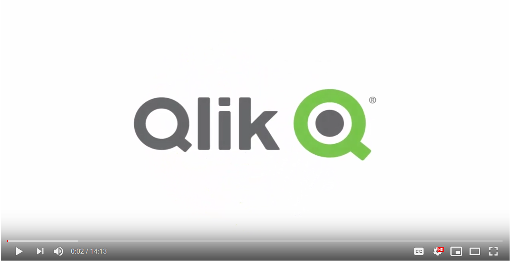
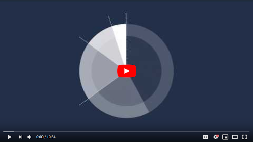
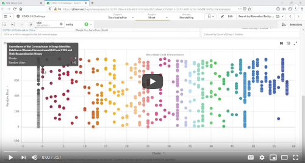
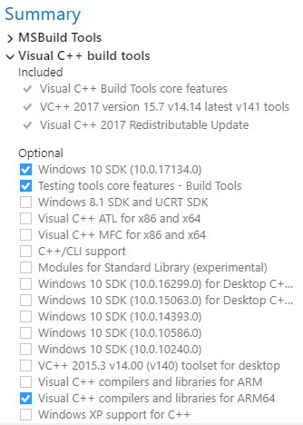
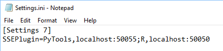
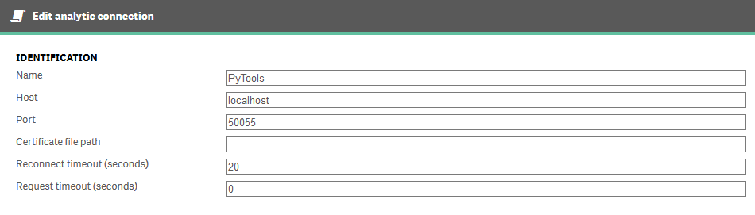
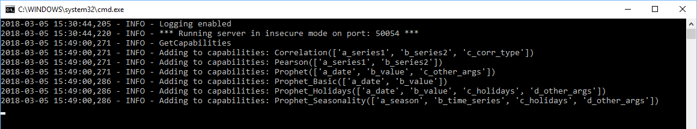

# Python data science tools for Qlik

## Announcements

Version 8.0 has been released. Get it [here](https://github.com/nabeel-oz/qlik-py-tools/releases) or with [Docker](https://hub.docker.com/r/nabeeloz/qlik-py-tools).

This release adds the capability to use pre-trained scikit-learn, Keras or REST API based models with Qlik. More on this [here](docs/Pretrained.md).

## Table of Contents

- [Introduction](#introduction)
    - [Demonstration Videos](#demonstration-videos)
- [Note on the approach](#note-on-the-approach)
- [Docker Image](#docker-image)
- [Pre-requisites](#pre-requisites)
- [Installation](#installation)
- [Usage](#usage)
- [Qonnections 2019 Workshop](#qonnections-2019-workshop)


## Introduction
Qlik's advanced analytics integration provides a path to making modern data science algorithms accessible to the wider business audience. This project is an attempt to show what's possible.

This repository provides a server side extension (SSE) for Qlik Sense built using Python. The intention is to provide a set of functions for data science that can be used as expressions in Qlik. 

Sample Qlik Sense apps are included and explained so that the techniques shown here can be easily replicated.

The current implementation includes:

- **Supervised Machine Learning** : Implemented using [scikit-learn](http://scikit-learn.org/stable/index.html), the go-to machine learning library for Python. This SSE implements the full machine learning flow from data preparation, model training and evaluation, to making predictions in Qlik. 
- **Unsupervised Machine Learning** : Also implemented using [scikit-learn](http://scikit-learn.org/stable/index.html). This provides capabilities for dimensionality reduction and clustering.
- **Deep Learning** : Implemented using [Keras](https://keras.io/) and [TensorFlow](https://www.tensorflow.org/). This SSE implements the full flow of setting up a neural network, training and evaluating it, and using it to make predictions. Deep Learning models can be used for sequence predictions and complex timeseries forecasting.
- **Use of pretrained ML models in Qlik** : Pre-trained scikit-learn, Keras and REST API based models can be called from this SSE, allowing predictions to be exposed within the broader analysis and business context of a Qlik app. The implementation also allows for What-if analysis using the models.
- **Named Entity Recognition** : Implemented using [spaCy](https://spacy.io/), an excellent Natural Language Processing library that comes with pre-trained neural networks. This SSE allows you to use spaCy's models for Named Entity Recognition or retrain them with your data for even better results.
- **Association rules** : Implemented using [Efficient-Apriori](https://github.com/tommyod/Efficient-Apriori). Association Rules Analysis is a data mining technique to uncover how items are associated to each other. This technique is best known for Market Basket Analysis, but can be used more generally for finding interesting associations between sets of items that occur together, for example, in a transaction, a paragraph, or a diagnosis.
- **Clustering** : Implemented using [HDBSCAN](https://hdbscan.readthedocs.io/en/latest/comparing_clustering_algorithms.html), a high performance algorithm that is great for exploratory data analysis.  
- **Time series forecasting** : Implemented using [Facebook Prophet](https://research.fb.com/prophet-forecasting-at-scale/), a modern library for easily generating good quality forecasts. Now with the ability to use multiple regressors as input.
- **Seasonality and holiday analysis** : Also using Facebook Prophet.
- **Linear correlations** : Implemented using Pandas.

Further information on these features is available through the [Usage](#usage) section below.

For more information on Qlik Server Side Extensions see [qlik-oss](https://github.com/qlik-oss/server-side-extension).

**Disclaimer:** This project has been started by me in a personal capacity and is not supported by Qlik. 

### Demonstration Videos
Forecasting, Clustering & Supervised Machine Learning:

[](https://youtu.be/7E944kz1l5s)

Deep Learning & Additional Regressors with Prophet:

[](https://youtu.be/KM0Fo1wdMYw)

Clustering COVID-19 Literature:

[](https://youtu.be/5fYWgglx84M)

## Note on the approach
In this project we have defined functions that expose open source algorithms to Qlik using the [gRPC framework](http://www.grpc.io/). Each function allows the user to define input data and parameters to control the underlying algorithm's output. 

While native Python script evaluation is possible in Qlik as demonstrated in the [qlik-oss Python examples](https://github.com/qlik-oss/server-side-extension/blob/master/examples/python/GetStarted.md), I have disabled this functionality in this project.

I prefer this approach for two key reasons:
- Separation of the Python implementation from usage in Qlik: App authors in Qlik just need to be able to use the functions, and understand the algorithms at a high level. Any complexity such as handling missing values or scaling the data is abstracted to simple parameters passed in the Qlik expression.
- Security: This server side extension can not be used to execute arbitrary code from Qlik. Users are restricted to the algorithms exposed through this SSE. Security can be further enhanced by running the SSE on a separate, sandboxed machine, and [securing communication with certificates](https://github.com/qlik-oss/server-side-extension/blob/master/generate_certs_guide/README.md).


## Docker Image

A Docker image for qlik-py-tools is available on [Docker Hub](https://hub.docker.com/r/nabeeloz/qlik-py-tools/). If you are familiar with containerisation this is the simplest way to get this SSE running in your environment. 

If you want to install this SSE locally on a Windows machine, you can jump to the [Pre-requisites](#pre-requisites) section.

To pull the image from Docker's public registry use the command below:
```
docker pull nabeeloz/qlik-py-tools
```
The image uses port 50055 by default. You can add encryption using certificates as explained [here](https://github.com/qlik-oss/server-side-extension/blob/master/generate_certs_guide/README.md).

```
docker run -p 50055:50055 -it nabeeloz/qlik-py-tools
```
Containers built with this image only retain data while they are running. This means that to persist trained models or log files you will need to add a volume or bind mount using [Docker capabilities for managing data](https://docs.docker.com/storage/).

```
# Store predictive models to a Docker volume on the host machine
docker run -p 50055:50055 -it -v pytools-models:/qlik-py-tools/models nabeeloz/qlik-py-tools

# Store log files to a bind mount on the host machine
docker run -p 50055:50055 -it -v ~/Documents/logs:/qlik-py-tools/core/logs nabeeloz/qlik-py-tools

# Run a container in detached mode, storing predictive models on a volume and logs on a bind mount
docker run \
    -p 50055:50055 \
    -d \
    -v pytools-models:/qlik-py-tools/models \
    -v ~/Documents/logs:/qlik-py-tools/core/logs \
    nabeeloz/qlik-py-tools
    
# Run a container in detached mode, storing predictive models on a volume , logs on a bind mount and restart the container on reboot
docker run \
    -p 50055:50055 \
    -d \
    --restart unless-stopped \
    -v pytools-models:/qlik-py-tools/models \
    -v ~/Documents/logs:/qlik-py-tools/core/logs \
    nabeeloz/qlik-py-tools

# Run a container in detached mode, restart on reboot, store models and logs to bind mounts, and use certificates for secure communication
docker run \
-p 50055:50055 \
-d \
--restart unless-stopped \
--name qlik-py-tools \
-v ~/sse_PyTools_generated_certs/sse_PyTools_server_certs:/qlik-py-tools/pem-dir \
-v ~/Documents/models:/qlik-py-tools/models \
-v ~/Documents/logs:/qlik-py-tools/core/logs \
nabeeloz/qlik-py-tools python __main__.py --pem_dir=/qlik-py-tools/pem-dir
```


## Pre-requisites

- Qlik Sense Enterprise or Qlik Sense Desktop
- Python >= 3.4 <= 3.6.9. The recommended version is 3.6.8.
    - _Note: The latest stable version of Python for this SSE is 3.6. The `pystan` library, which is required for `fbprophet`, is known to have issues with Python 3.7 on Windows._
- Microsoft Visual C++ Build Tools


## Installation

This installation requires Internet access. To install this SSE on a machine without Internet access refer to the [offline installation guide](offline-install/).

1. Get Python from [here](https://www.python.org/downloads/release/python-368/). Make sure you get the 64 bit version. Remember to select the option to add Python to your PATH environment variable.

2. You'll also need a recent C++ compiler as this is a requirement for the `pystan` library used by `fbprophet`. One option is to use [Microsoft Visual C++ Build Tools](https://visualstudio.microsoft.com/downloads/#build-tools-for-visual-studio-2017). If you are having trouble finding the correct installer try [this direct link](https://www.visualstudio.com/thank-you-downloading-visual-studio/?sku=BuildTools&rel=15). An alternative is to use the `mingw-w64` compiler as described in the [PyStan documentation](http://pystan.readthedocs.io/en/latest/windows.html). 
     - If you're using the Visual Studio installer, select the Visual C++ Build Tools workload in the installer and make sure you select the C++ compilers in the optional components:<br/><br/>

3. Download the [latest release](https://github.com/nabeel-qlik/qlik-py-tools/releases) for this SSE and extract it to a location of your choice. The machine where you are placing this repository should have access to a local or remote Qlik Sense instance.

4. Right click `Qlik-Py-Init.bat` and chose 'Run as Administrator'. You can open this file in a text editor to review the commands that will be executed. If everything goes smoothly you will see a Python virtual environment being set up, project files being copied, some packages being installed and TCP Port `50055` being opened for inbound communication. 
     - Note that the script always ends with a "All done" message and does not check for errors. 
     - If you need to change the port you can do so in the file `core\__main__.py` by opening the file with a text editor, changing the value of the `_DEFAULT_PORT` variable, and then saving the file. You will also need to update `Qlik-Py-Init.bat` to use the same port in the `netsh` command. This command will only work if you run the batch file through an elevated command prompt (i.e. with administrator privileges).
     - Once the execution completes, do a quick scan of the log to see everything installed correctly. The libraries imported are: `grpcio`, `grpcio-tools`, `numpy`, `scipy`, `pandas`, `cython`, `joblib`, `pyyaml`, `pystan`, `fbprophet`, `scikit-learn`, `hdbscan`, `spacy`, `efficient-apriori`, `tensorflow`, `keras` and their dependencies. Also, check that the `core` and `generated` directories have been copied successfully to the newly created `qlik-py-env` directory.
     - If the initialization fails for any reason, you can simply delete the `qlik-py-env` directory and re-run `Qlik-Py-Init.bat`.

5. Now whenever you want to start this Python service you can run `Qlik-Py-Start.bat`.

6. Now you need to [set up an Analytics Connection in Qlik Sense Enterprise](https://help.qlik.com/en-US/sense/November2019/Subsystems/ManagementConsole/Content/Sense_QMC/create-analytic-connection.htm) or [update the Settings.ini file in Qlik Sense Desktop](https://help.qlik.com/en-US/sense/November2019/Subsystems/Hub/Content/Sense_Hub/Introduction/configure-analytic-connection-desktop.htm). If you are using the sample apps make sure you use `PyTools` as the name for the analytics connection, or alternatively, update all of the expressions to use the new name.
     - For Qlik Sense Desktop you need to update the `settings.ini` file. There may be two copies of this file; one at `C:/Users/<User ID>/Documents/Qlik/Sense/` and another at `C:/Users/AppData/Local/Programs/Qlik/Sense/Engine`. Add the SSE settings to both files.<br/><br/>
        ```
        SSEPlugin=PyTools,localhost:50055;
        ```
     - For Qlik Sense Enterprise you need to create an Analytics Connection through QMC:<br/><br/>
     - The Analytics Connection can point to a different machine and can be [secured with certificates](https://github.com/qlik-oss/server-side-extension/blob/master/generate_certs_guide/README.md):<br/><br/>

7. Finally restart the Qlik Sense engine service for Qlik Sense Enterprise or close and reopen Qlik Sense Desktop. This step may not be required if you are using Qlik Sense April 2018 and beyond. 

    If a connection between Python and Qlik is established you should see the capabilities listed in the terminal.


*Capabilities may change as this is an ongoing project.*


## Usage

We go into the details of each capability in the sections below.

Sample Qlik Sense apps are provided and each app includes extensive techniques to use this SSE's capabilities in Qlik.

Most of the sample apps require the Dashboard Extension Bundle which was released with Qlik Sense November 2018.

| Documentation | Sample App | Additional App Dependencies |
| --- | --- | --- |
| [Correlations](docs/Correlation.md) | [Correlations](docs/Sample_App_Correlations.qvf) | None. |
| [Clustering](docs/Clustering.md) | [Clustering with HDBSCAN](docs/Sample_App_Clustering.qvf) | None. |
| [Predictions with pretrained models](docs/Pretrained.md) | [Predictions with scikit-learn and Keras](docs/Sample-App-Pretrained-Predict.qvf) | Follow the [pre-requisites](docs/Pretrained.md#pre-requisites) and [steps](docs/Pretrained.md#complete-example) in the documentation.<br><br>If using Qlik Sense Desktop you will need to download the [data source](docs/HR-Employee-Attrition.xlsx), create a data connection named `AttachedFiles` in the app, and point the connection to the folder containing the source file. |
| [Machine Learning](docs/scikit-learn.md) | [Train & Test](docs/Sample-App-scikit-learn-Train-Test.qvf)<br><br>[Predict](docs/Sample-App-scikit-learn-Predict.qvf)<br><br>[K-fold Cross Validation](docs/Sample-App-scikit-learn-K-fold-Cross-Validation.qvf)<br><br>[Parameter Tuning](docs/Sample-App-scikit-learn-Parameter-Tuning.qvf)<br><br>[K-fold CV & Parameter Tuning](docs/Sample-App-scikit-learn-K-fold-CV-Grid-Search.qvf)<br><br>[Complex Forecasting with scikit-learn](docs/Sample-App-Forecasting-with-Sklearn.qvf) | Make sure you reload the K-fold Cross Validation or Train & Test app before using the Predict app.<br><br>If using Qlik Sense Desktop you will need to download the [data source](docs/HR-Employee-Attrition.xlsx), create a data connection named `AttachedFiles` in the app, and point the connection to the folder containing the source file.<br><br>The forecasting app is best understood together with the Deep Learning section below. Here we just use more traditional ML algorithms rather than Deep Learning for producing the forecast.<br><br>Make sure you reload the app before using the final sheets to make predictions. The data source for this app can be found [here](docs/bike-sharing/). |
| [Deep Learning](docs/Keras.md) | [Complex Forecasting with Keras](docs/Sample-App-Forecasting-with-Keras.qvf) | Make sure you reload the app before using the final two sheets to make predictions.<br><br>If using Qlik Sense Desktop you will need to download the [data source](docs/bike-sharing/), create a data connection named `AttachedFiles` in the app, and point the connection to the folder containing the source file. |
| [Forecasting](docs/Prophet.md) | [Facebook Prophet (Detailed)](docs/Sample_App_Prophet.qvf)<br><br>[Facebook Prophet (Simple)](docs/Sample_App_Forecasting_Simple.qvf)<br><br>[Facebook Prophet (Multiple regressors)](docs/Sample-App-Prophet-Multivariate.qvf) | For the detailed app, use the bookmarks to step through the sheets with relevant selections.<br><br>For calling Prophet through the load script refer to the simple app. If you want to reload the app using Qlik Sense Desktop you will need to download the [data source](docs/VIC-Emergency-Department-Attendances.xlsx), create a data connection named `AttachedFiles` in the app, and point the connection to the folder containing the source file.<br><br>For the use of Prophet's additional regressors capability refer to the multiple regressors app. The data for this app is found [here](docs/bike-sharing/). |
| [Named Entity Recognition](docs/NER.md) | [NER and Association Rules](docs/Sample-App-NER-Apriori.qvf) | If using Qlik Sense Desktop you will need to download the [data sources](docs/LOTR/), create a data connection named `AttachedFiles` in the app, and point the connection to the folder containing the source files. |
| [Association Rules / Market Basket Analysis](docs/Association-Rules.md) | [NER and Association Rules](docs/Sample-App-NER-Apriori.qvf)<br><br>[Market Basket Analysis](docs/Sample-App-Market-Basket.qvf) | If using Qlik Sense Desktop you will need to download the [data sources](docs/LOTR/), create a data connection named `AttachedFiles` in the app, and point the connection to the folder containing the source files. |

## Qonnections 2019 Workshop

At Qonnections 2019 we ran hands-on workshops with PyTools and Qlik Sense. The content for these workshops, including the sample apps and exercise intructions, is available [here](docs/hands-on/README.md).

The workshop exercises can be used as a tutorial for using this Server Side Extension with Qlik Sense Enterprise or Desktop.
