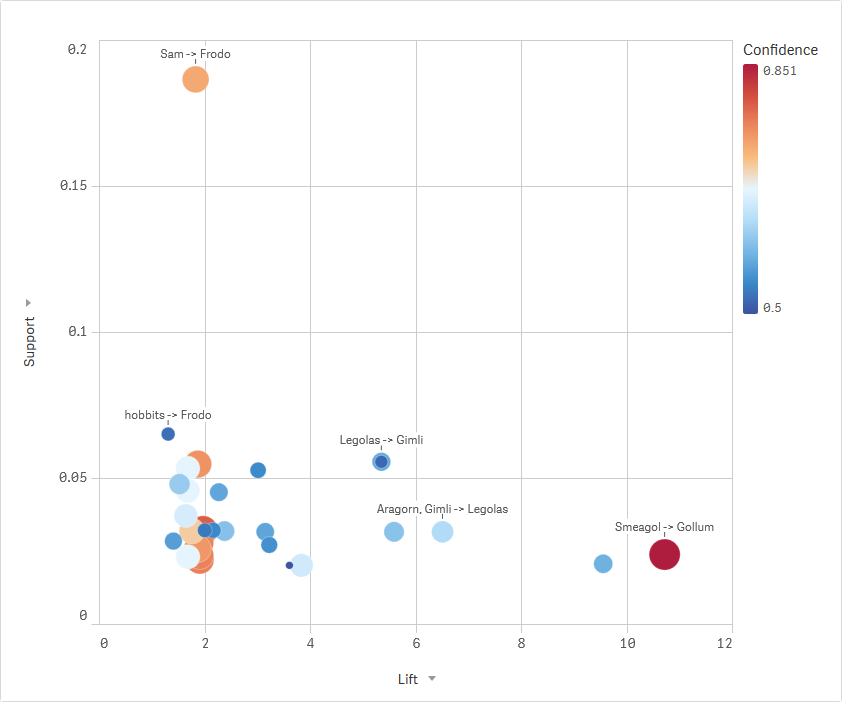
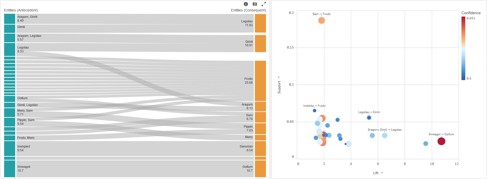

# Association Rules Analysis with Efficient-Apriori

## Table of Contents

- [Introduction](#introduction)
- [Measures to evaluate rules](#measures-to-evaluate-rules)
- [Quick Start](#quick-start)
- [Additional Parameters](#additional-parameters)
- [Finding associations in the Lord of the Rings](#finding-associations-in-the-lord-of-the-rings)
- [Market Basket Analysis](#market-basket-analysis)
- [Attribution](#attribution)

## Introduction

Association Rules Analysis is a data mining technique to uncover how items are associated to each other. A rule can be thought of as an if-then statement such as `{bread, avocado} -> {vegemite}` where the left hand side is the antecedent and the right hand side is the consequent.

This technique is best known for Market Basket Analysis, but can be used more generally for finding interesting associations between sets of items that occur together, for example, in a transaction, a paragraph, or a diagnosis.

In this SSE, we have used the [Efficient-Apriori](https://github.com/tommyod/Efficient-Apriori) Python implementation of the Apriori algorithm.

## Measures to evaluate rules

There are standard measures that help to measure the association between items:

- Support: The support of a rule is the frequency of which the antecedent and consequent appear together in the dataset. If `X -> Y`, then the support is `P(Y and X)`.
- Condifence: The confidence of a rule is the probability of the consequent given the antecedent. If `X -> Y`, then the confidence is `P(Y|X)`.
- Lift: The lift of a rule is the ratio of the observed support to the expected support if the antecedent and consequent were independent. If X -> Y, then the lift is given by the fraction P(X and Y) / (P(X) * P(Y)). 

## Quick Start

The PyTools Server-Side Extension (SSE) provides the `Association_Rules` function to generate association rules. This function uses the [Efficient-Apriori](https://github.com/tommyod/Efficient-Apriori) Python implementation of the Apriori algorithm. This function can only be used from the Data Load Editor.

First we prepare a table that provides the items for each group and a string that contains any additional parameters. Each row in the table should contain a single item and the grouping will be performed by the SSE based on the `group` field.

```
// Load entities of interest by paragraph
[EntitiesTemp]:
LOAD DISTINCT
    ParagraphID as group, // Group by paragraph
    [Entity v2] as item,
    'debug=false, min_support=0.001|float' as args
RESIDENT [Named Entities v2]
WHERE Match([Entity Type v2], 'PERSON', 'LOC', 'GPE', 'FAC', 'FACTION', 'NORP', 'ORG', 'PRODUCT') > 0;
```

We then use this table as input to call the `Association_Rules` function. The response from the function is the rule, items on the left hand side and right hand side as separate fields, a well as the key measures of support, confidence and lift.

```
// Use the LOAD...EXTENSION syntax to call the Association_Rules function
[Association Rules]:
LOAD 
    rule as [Association Rule],
    rule_lhs as [Entities LHS],
    rule_rhs as [Entities RHS],
    support as Support,
    confidence as Confidence,
    lift as Lift
EXTENSION PyTools.Association_Rules(Entities{para, item, args});
```

If you do not get any results, consider the changing the default limits on minimum support and confidence as described in the [Additional Parameters](#additional-parameters) section.



## Additional Parameters

The additional arguments provided through the last parameter in the input table lets you control the behavior of the SSE function.

These arguments can be included in the final string parameter for the function using the syntax: `keyword=value`. Separate arguments with a comma and use single quotes around the entire string. For arguments specific to `efficient-apriori` you need to provide the data type of the value as well using the `|` delimiter e.g. `'debug=true, min_support=0.2|float, max_length=10|int'`

| Keyword | Description | Sample Values | Remarks |
| --- | --- | --- | --- |
| debug | Flag to output additional information to the terminal and logs. | `true`, `false` | Information will be printed to the terminal as well to a log file: `..\qlik-py-env\core\logs\spaCy Log <n>.txt`. |
| min_support | The minimum support of the rules returned.<br><br>The support is frequency of which the items in the rule appear together in the data set. | `0.2\|float`, `0.001\|float` | If you do not get any rules in the response, this is the first parameter to consider.<br><br>The default value is set to `0.5` |
| min_confidence  | The minimum confidence of the rules returned.<br><br>Given a rule `X -> Y`, the confidence is the probability of Y, given X, i.e. `P(Y\|X) = conf(X -> Y)`. | `0.5\|float`, `0.8\|float` | The default value is set to `0.5` |
| max_length | The maximum length of the items in a rule, inclusive of antecedents and consequents. | `5\|int`, `10\|int` | The default value is set to `8` |

## Finding associations in the Lord of the Rings

The [sample app](Sample-App-NER-Apriori.qvf) shows Association Rules found for entities in the Lord of the Rings novels. These entities themselves are identified using another technique called Named Entity Recognition that is covered [here](NER.md#ner-on-the-lord-of-the-rings).

The association rules are generated in the Data Load Editor. First, take a look at the `Entities before and after` section. Here, we collect the entities that we want to analyze for associations. In this case, we are considering entities in paragraph together with those that appear a paragraph above or below in the same chapter. 

The `Entities` table prepared in this section will be the input to our `Association_Rules` function call to the SSE. Note the `args` field sets a `min_support` limit that works for this dataset. You will need to consider and tune this parameter for your own dataset.

The `Apriori Association Rules` sheet generates the association rules together with the support, confidence and lift. 

Switch to Analysis mode and go to the `Entity Associations` sheet to explore the associations between entities.



## Market Basket Analysis

For an example on Market Basket Analysis refer to the [second sample app](Sample-App-Market-Basket.qvf) on Association Rules. This app applies Association Rules to a real dataset of over 500,000 transactions from an online retailer. 

## Attribution
The data used in the Lord of the Rings sample app was obtained from the [Lord of the Rings Data](https://www.kaggle.com/mokosan/lord-of-the-rings-character-data#LordOfTheRingsBook.json) on Kaggle.com.

The data used in the Market Basket Analysis sample app was obtained from the [Online Retail dataset](http://archive.ics.uci.edu/ml/datasets/online+retail) on the UCI Machine Learning Repository.
