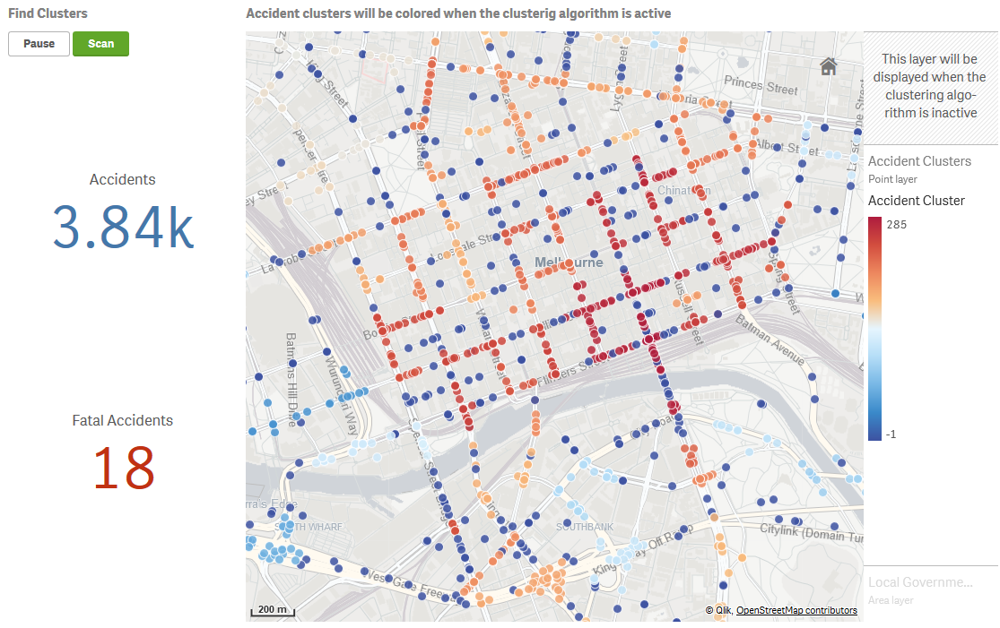
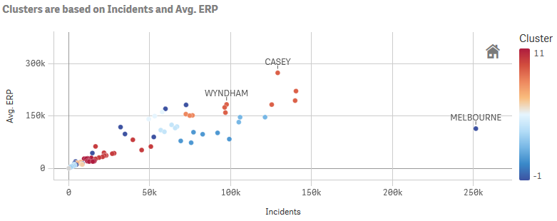
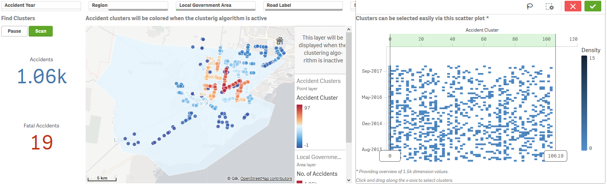
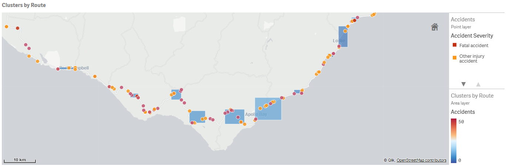

# Clustering with HDBSCAN

## Table of Contents

- [Introduction](#introduction)
- [Quick Start](#quick-start)
   - [Clustering with multiple features](#clustering-with-multiple-features)   
   - [Clustering by a second dimension](#clustering-by-a-second-dimension)
   - [Geospatial clustering](#geospatial-clustering)
- [Additional Parameters](#additional-parameters)
   - [Basic Parameters](#basic-parameters)
   - [Scaler Parameters](#scaler-parameters)
   - [HDBSCAN Parameters](#hdbscan-parameters)
- [Use Clustering with your own app](#use-clustering-with-your-own-app)
   - [Clustering with multiple measures](#clustering-with-multiple-measures)
   - [Clustering with many features](#clustering-with-many-features)
   - [Clustering geospatial data](#clustering-geospatial-data)
- [Attribution](#attribution)

## Introduction

Clustering is an unsupervised machine learning technique that involves grouping of data points based on the similarity of input features. There are several clustering algorithms avaialble, but I've picked [HDBSCAN](https://hdbscan.readthedocs.io/en/latest/basic_hdbscan.html) for this implementation as it gives good quality results for exploratory data analysis and performs really well. A good comparison of several clustering algorithms in Python is covered in the [HDBSCAN documentation](https://hdbscan.readthedocs.io/en/latest/comparing_clustering_algorithms.html). 

The clustering functions in this SSE provide the capabilities of HDBSCAN in Qlik through simple expressions.

## Quick Start

The HDBSCAN algorithm will classify the input dimension into clusters. The labels are the default output, with `-1` representing outliers and labels `0` and above representing clusters.

### Clustering with multiple features

The `Cluster` function takes in three parameters: the dimension to be clustered, the set of features as a concatenated string, and a string where we can supply optional key word arguments.

```
<Analytic connection name>.Cluster([Dimension], [Measure 1] & ';' & [Meaure 2] ..., 'arg1=value1, arg2=value2, ...')
```

The features need to be a semi-colon separated string. Optional key word arguments are covered in more detail in the Additional Parameters section below.

Here's an example of an actual expression:

```
PyTools.Cluster([Local Government Area], sum([Incidents Recorded]) & ';' & avg(ERP), 'scaler=robust, min_cluster_size=3')
```

In this example we are clustering Local Government Areas in Victoria, Australia by the number of crimes and the estimated residential population. We are also using the key word arguments to specify that we want to apply scaling to our features using the scikit-learn RobustScaler and we want the minimum cluster to be at least 3 LGAs.

### Clustering by a second dimension

If clusters are being classified as data is loaded into Qlik we can use a second dimension to create features based on an expression. The function will pivot the data using this second dimension, before scanning for clusters.

This is done using the `Cluster_by_Dim` function:

```
LOAD
    key,
    labels
EXTENSION <Analytic connection name>.Cluster_by_Dim(TableName{[Dimension 1], [Dimension 2], [Expression], 'arg1=value1, arg2=value2, ...'})
```

This function can only be used in the Qlik Load Script as the [input and output number of rows will be different](https://github.com/qlik-oss/server-side-extension/blob/master/docs/limitations.md#expressions-using-sse-must-persist-the-cardinality).

Here's an example where we use the `Cluster_by_Dim` function using the [LOAD...EXTENSION](https://help.qlik.com/en-US/sense/April2018/Subsystems/Hub/Content/Scripting/ScriptRegularStatements/Load.htm) syntax:

```
[LGA Clusters by Subgroup]:
LOAD
    key as [Local Government Area],
    labels as [Clusters by Subgroup]
EXTENSION PyTools.Cluster_by_Dim(TempInputsTwoDims{LGA, SubGroup, Rate, Args});
```

The function returns a table with two fields; the first dimension in the input parameters and the corresponding clustering labels.

### Geospatial clustering

The HDBSCAN algorithm works well with geospatial coordinates as well. For this you can use the `Cluster_Geo` function:

```
<Analytic connection name>.Cluster_Geo([Dimension], [Latitude], [Longitude], 'arg1=value1, arg2=value2, ...')
```

The latitude and longitude need to be provided as separate fields in decimal format. 

Here's an example where we cluster accidents by location:

```
PyTools.Cluster_Geo(ACCIDENT_NO, Lat, Long, '')
```



## Additional Parameters

The additional arguments provided through the last parameter in the functions give you control over the clustering output. If you don't need to specify any additional arguments you can pass an empty string.

Any of these arguments below can be included in the final string parameter for the clustering functions defined above using the syntax: `argument=value`. Separate arguments with a comma and use single quotes around the entire string.

### Basic Parameters

| Keyword | Description | Sample Values | Remarks |
| --- | --- | --- | --- |
| return | The output of the expression. | `labels`, `probabilities` | `labels` refers to the clustering classification. This is the default value if the parameter is not specified. The cluster labels start at 0 and count up. HDBSCAN is noise aware and has a notion of data samples that are not assigned to any cluster. This is handled by assigning these samples the label -1. <br/><br/>The HDBSCAN library implements soft clustering, where each data point is assigned a cluster membership score ranging from 0.0 to 1.0. You can access these scores via the argument `return=probabilities`. |
| debug | Flag to output additional information to the terminal and logs. | `true`, `false` | Information will be printed to the terminal as well to a log file: `..\qlik-py-env\core\logs\Cluster Log <n>.txt`. Particularly useful is looking at the input and output Data Frames. <br/><br/>The default value is `false`. |
| load_script | Flag to set the output format for the function. | `true`, `false` | Set to `true` if calling the functions from the load script in the Qlik app. This will change the output to a table consisting of two fields the `key` which is the first dimension being clustered, and the specified return value (`labels` or `probabilities`). <br/><br/>You do not need to specify this parameter for the `Cluster_by_Dim` function as that can only be used through the load script. The default value for the `Cluster` and `Cluster_Geo` function is `false`. |
| missing | Strategy for handling missing / null values. | `zeros`, `mean`, `median`, `mode` | Any missing values in the data need to be handled before the clustering algorithm can be executed. You should consider the best strategy based on your data. If using `mean`, `median` or `mode` the corresponding statistic for each feature column will be used to replace missing values in that column. <br/><br/>The default value is `zeros`. |
| scaler | Strategy for standardizing the data so that certain features don't skew the results. | `standard`, `minmax`, `maxabs`, `robust`, `quantile`, `none` | Standardizing the data is a common requirement for machine learning algorithmns. In this implementation we use the [sklearn.preprocessing](http://scikit-learn.org/stable/modules/preprocessing.html) package. <br/><br/>The default value is `robust`. |

### Scaler Parameters

In most cases, we need to standardize the data so that all features provided to the clustering algorithm are treated equally. This is a common step in machine learning and is automated in this implementation by specifying a `scaler` as described in the Basic Parameters section above.

The scaling options provided in this implementation make use of the scikit-learn library. For a better understanding of the options please refer to the documentation [here](http://scikit-learn.org/stable/modules/preprocessing.html).

| Keyword | Description | Sample Values | Remarks |
| --- | --- | --- | --- |
| with_mean | An option for the [StandardScaler](http://scikit-learn.org/stable/modules/generated/sklearn.preprocessing.StandardScaler.html#sklearn.preprocessing.StandardScaler). <br/><br/>If `true`, center the data before scaling. | `true`, `false` | The default value is `true`. |
| with_std | An option for the [StandardScaler](http://scikit-learn.org/stable/modules/generated/sklearn.preprocessing.StandardScaler.html#sklearn.preprocessing.StandardScaler). <br/><br/>If `true`, scale the data to unit variance (or equivalently, unit standard deviation). | `true`, `false` | The default value is `true`. |
| feature_range | An option for the [MinMaxScaler](http://scikit-learn.org/stable/modules/generated/sklearn.preprocessing.MinMaxScaler.html#sklearn.preprocessing.MinMaxScaler). <br/><br/>Desired range of transformed data. | `(0;100)` | The default value is `(0;1)`. |
| with_centering | An option for the [RobustScaler](http://scikit-learn.org/stable/modules/generated/sklearn.preprocessing.RobustScaler.html#sklearn.preprocessing.RobustScaler). <br/><br/>If `true`, center the data before scaling. | `true`, `false` | The default value is `true`. |
| with_scaling | An option for the [RobustScaler](http://scikit-learn.org/stable/modules/generated/sklearn.preprocessing.RobustScaler.html#sklearn.preprocessing.RobustScaler). <br/><br/>If `true`, scale the data to interquartile range. | `true`, `false` | The default value is `true`. |
| quantile_range | An option for the [RobustScaler](http://scikit-learn.org/stable/modules/generated/sklearn.preprocessing.RobustScaler.html#sklearn.preprocessing.RobustScaler). <br/><br/>Quantile range used to calculate the scale. | `(10.0;90.0)` | The default value is `(25.0;75.0)`. |
| n_quantiles | An option for the [QuantileTransformer](http://scikit-learn.org/stable/modules/generated/sklearn.preprocessing.QuantileTransformer.html#sklearn.preprocessing.QuantileTransformer). <br/><br/>Number of quantiles to be computed. It corresponds to the number of landmarks used to discretize the cumulative density function. | `1000` | The default value is `1000`. |
| output_distribution | An option for the [QuantileTransformer](http://scikit-learn.org/stable/modules/generated/sklearn.preprocessing.QuantileTransformer.html#sklearn.preprocessing.QuantileTransformer). <br/><br/>Marginal distribution for the transformed data. | `uniform`, `normal` | The default value is `uniform`. |
| ignore_implicit_zeros | An option for the [QuantileTransformer](http://scikit-learn.org/stable/modules/generated/sklearn.preprocessing.QuantileTransformer.html#sklearn.preprocessing.QuantileTransformer). <br/><br/>Only applies to sparse matrices. If True, the sparse entries of the matrix are discarded to compute the quantile statistics. If False, these entries are treated as zeros. | `true`, `false` | The default value is `false`. |
| subsample | An option for the [QuantileTransformer](http://scikit-learn.org/stable/modules/generated/sklearn.preprocessing.QuantileTransformer.html#sklearn.preprocessing.QuantileTransformer). <br/><br/>Maximum number of samples used to estimate the quantiles for computational efficiency. | `100000` | The default value is `100000`. |
| random_state | An option for the [QuantileTransformer](http://scikit-learn.org/stable/modules/generated/sklearn.preprocessing.QuantileTransformer.html#sklearn.preprocessing.QuantileTransformer). <br/><br/>If int, random_state is the seed used by the random number generator. If this is not specified, the random number generator is the RandomState instance used by np.random. Note that this is used by subsampling and smoothing noise. | `1` | The default value is None. |

### HDBSCAN Parameters

You may want to adjust the result of the clustering algorithm to best fit your data. HDBSCAN makes this process simple by providing just a few intuitive parameters that you need to consider for improving the results. [This article](https://hdbscan.readthedocs.io/en/latest/parameter_selection.html) gives a good explanation on how to choose these parameters effectively. 

On top of these parameters you may also need to consider the metric being used to calculate distance between instances of each feature. HDBSCAN borrows these metrics from the Scikit-Learn library and you can find more information on the options [here](http://scikit-learn.org/stable/modules/generated/sklearn.neighbors.DistanceMetric.html).

Most of the options available for the HDBSCAN class documented in the [API Reference](https://hdbscan.readthedocs.io/en/latest/api.html) are included in this implementation.

| Keyword | Description | Sample Values | Remarks |
| --- | --- | --- | --- |
| algorithm | Exactly which algorithm to use; HDBSCAN has variants specialised for different characteristics of the data. By default this is set to `best` which chooses the “best” algorithm given the nature of the data. You can force other options if you believe you know better. | `best`, `generic`, `prims_kdtree`, `prims_balltree`, `boruvka_kdtree`, `boruvka_balltree` | The default value is `best`. |
| metric | The metric to use when calculating distance between instances in a feature array.  | `euclidean`, `manhattan`, `canberra`, `precomputed` | A large number of distance metrics are avaialble. For a full list see [here](https://hdbscan.readthedocs.io/en/latest/basic_hdbscan.html#what-about-different-metrics). For a better understanding of distance metrics refer to the [sklearn documentation](http://scikit-learn.org/stable/modules/generated/sklearn.neighbors.DistanceMetric.html). <br/><br/>The default value is `euclidean`. For the `Cluster_Geo` function the default value is `haversine`. |
| min_cluster_size | The minimum size of clusters. | `3` | This is the primary parameter to effect the resulting clustering. Set it to the smallest size grouping that you wish to consider a cluster. More information [here](https://hdbscan.readthedocs.io/en/latest/parameter_selection.html#selecting-min-cluster-size). <br/><br/>The default value is `5`. |
| min_samples | The number of samples in a neighbourhood for a point to be considered a core point. | `5` | The larger the value of min_samples you provide, the more conservative the clustering – more points will be declared as noise, and clusters will be restricted to progressively more dense areas. More information [here](https://hdbscan.readthedocs.io/en/latest/parameter_selection.html#selecting-min-samples). <br/><br/>If this parameter is not specified the default value is equal to `min_cluster_size`. |
| cluster_selection_method | The method used to select clusters from the condensed tree. | `eom`, `leaf` | If you are more interested in having small homogeneous clusters then you may find the default option, Excess of Mass, has a tendency to pick one or two large clusters and then a number of small extra clusters. You can use the `leaf` option to select leaf nodes from the tree, producing many small homogeneous clusters. Note that you can still get variable density clusters via this method, and it is also still possible to get large clusters, but there will be a tendency to produce a more fine grained clustering than Excess of Mass can provide. More information [here](https://hdbscan.readthedocs.io/en/latest/parameter_selection.html#leaf-clustering). <br/><br/>The default value is `eom`. |
| allow_single_cluster | By default HDBSCAN* will not produce a single cluster. Setting this to `true` will override this and allow single cluster results. | `true`, `false` | More information [here](https://hdbscan.readthedocs.io/en/latest/parameter_selection.html#allowing-a-single-cluster). <br/><br/>The default value is `false`. |
| p | p value to use if using the minkowski metric. | `2` | The default value is None. |
| alpha | A distance scaling parameter as used in robust single linkage. | `1.0` | In practice it is best not to mess with this parameter. More information [here](https://hdbscan.readthedocs.io/en/latest/parameter_selection.html#selecting-alpha). <br/><br/>The default value is `1.0`. |
| match_reference_implementation | Flag to switch between the standard HDBSCAN implementation and the original authors reference implementation in Java. | `true`, `false` | This can result in very minor differences in clustering results. Setting this flag to `true` will, at a some performance cost, ensure that the clustering results match the reference implementation. <br/><br/>The default value is `false`. |

## Use Clustering with your own app

You should have completed the installation instructions in the master README.md.

The [sample app](Sample_App_Clustering.qvf) can be used as a template for the instructions below.

You can choose to use the clustering functions in chart expressions or in the load script. The first option allows for clustering on the fly in the context of user's selections and is obviously very powerful. However, there are good reasons why you may want to apply clustering during the data load:
- Handle large data volumes by running the algorithm in batches
- Prepare a large number of features to send to the algorithm
- Add clusters as dimensions in the data model

The sample app includes examples for all three functions using both chart expressions and the load script.

### Clustering with multiple measures

If the number of measures is relatively small you can simply concatenate them into a string when passing the measures to the `Cluster` function. 

In the example below we are clustering Local Government Areas by the number of incidents and the average population. The two measures are concatenated into a string according to the Qlik expression syntax. You must use a semi-colon to separate the measures, as the numbers may contain comma separators. 

```
PyTools.Cluster([Local Government Area], sum([Incidents Recorded]) & ';' & avg(ERP), 'scaler=quantile, min_cluster_size=3, min_samples=2')
```

The function will break down the string into individual features. To check that the inputs are being read correctly you can use the `debug=true` argument.

The expression above is used to colour the scatter plot below:



You may want to make the clustering more dynamic by letting the user select several values in a particular dimension and then generating measures for each value in the selection using set analysis. 

For example the set analysis expression for the first selected value in the `Offence Subdivision` field would be:

```
{$<[Offence Subdivision] = {"$(=SubField(Concat(Distinct [Offence Subdivision],';'),';',1))"}>}
```

You can get the second selected value in the field simply by incrementing the third argument in the `Subfield` expression. Using such set analysis you can then calculate multiple measures based on the selected values in `Offence Subdivision` and combine them into a string. 

Refer to the `Clusters using a dynamic expression` sheet and the `vRatesBySubdivision` variable in the sample app for a complete example.

### Clustering with many features

The techniques above may not be practical if you want to use a large number of features for clustering. This is best handled through the Data Load Editor. 

In the sample app's load script we show two techniques to run the clustering algorithm with a large number of features. In our example we want to cluster incident rates per 100,000 population by offence subgroup. To do this we need to run the clustering with 112 features; one column per offence subgroup. 

The simpler technique is to use the `Cluster_by_Dim` function. This function takes in two dimensions and one measure. The first dimension is the field we want to check for clusters, while the second dimension is the field for which we want to create features based on the measure. The function will pivot the data using this second dimension, before scanning for clusters.

We first create a table that gives us the incident rates by Local Government Area and Offence Subgroup:

```
LOAD
	 "Local Government Area",
	 "Offence Subgroup",
	 Num(("Incidents Recorded"/"ERP") * 100000, '#,###.00') as "2017 Offence Rate"
RESIDENT [Temp_SG_Rates_2017];
```

We can then prepare a temporary table that will be used as input for the clustering function:

```
[TempInputsTwoDims]:
LOAD
	 [Local Government Area] as LGA, // Dimension to scan for clusters
	 SubField("Offence Subgroup", ' ', 1) as SubGroup, // Dimension for creating features
	 "2017 Offence Rate" as Rate, // Measure to use in the feature columns
	 'scaler=quantile,min_cluster_size=3,min_samples=2,cluster_selection_method=leaf' as Args // Additional arguments to pass to the function
RESIDENT [Temp_SG_Rates_2017];
```

Then we use the `LOAD...EXTENSION` syntax to call the `Cluster_By_Dim` function:

```
[LGA Clusters by Subgroup]:
LOAD
	 key as [Local Government Area],
	 labels as [Clusters by Subgroup]
EXTENSION PyTools.Cluster_by_Dim(TempInputsTwoDims{LGA, SubGroup, Rate, Args});

Drop table [TempInputsTwoDims];
````

Alternatively, the feature columns can be prepared using the native ETL capabilities of Qlik. This is demonstrated in the `Subgroup Features` section where we pivot the data and then concatenate the measures by offence subgroup into a string of 112 features. With this approach we can just use the `Cluster` function.

```
// First we prepare a table for use in the function call
[TempInputsStandard]:
LOAD
    "Local Government Area" as LGA,
    SubGroup_Features as Features,
    'load_script=true,scaler=quantile,min_cluster_size=3,min_samples=2,cluster_selection_method=leaf' as Args
RESIDENT [2017 Rate by Subgroup Pivot];

// Then we use the LOAD...EXTENSION syntax to call the Cluster function
[LGA Clusters by Subgroup (Standard)]:
LOAD 
    key as [Local Government Area],
    labels as [Clusters by Subgroup (Standard)]
EXTENSION PyTools.Cluster(TempInputsStandard{LGA, Features, Args});

Drop tables [TempInputsStandard];
```

Note the use of the `load_script=true` argument to get the function to include the key field in the output. This is done by default for the `Cluster_by_Dim` function as it is only meant to be used in the load script.

### Clustering geospatial data

HDBSCAN's density based clustering performs well for geospatial data as well. In our sample app we demonstrate this with road accident data from Victoria, Australia. 

The `On the fly Geospatial clustering` sheet performs clustering for accidents based on the latitude and longitude. 

```
PyTools.Cluster_Geo(ACCIDENT_NO, Lat, Long, '')
```

This function will by default apply the `haversine` distance metric and convert the decimal values for latitude and longitude to radians as required by HDBSCAN. 

This technique works best for a limited number of points so that the clusters can be explored. Here we provide filters for the user to drill down to the accidents of interest, and then activate clustering using the `Scan` button. The map visualization switches between two point layers based on the buttons, with the clustering layer using the `Cluster_Geo` function for the colour expression and labels.

The scatter plot can be used to select particular clusters by clicking and dragging along the x-axis. For example, you can remove outliers by selecting clusters with labels 0 and above.



Geospatial clustering across a large number of points can be performed during the data load. This also gives us the ability to create polygons for the clusters.

The clustering may need to be performed in batches to avoid memory issues. Choosing a logical dimension to iterate over and perform the clustering should also help with the quality of results. In our example we cluster accidents by road route.

```
// We will scan for clusters along each route in the data
For Each vRoad in FieldValueList('ROAD_ROUTE_1')

  // We prepare a table for use in the function call
  [TempInputsStandard]:
  LOAD DISTINCT
      ACCIDENT_NODE_ID,
      Lat,
      Long,
      'load_script=true' as Args
  RESIDENT [Temp Nodes]
  WHERE ROAD_ROUTE_1 = '$(vRoad)' and Len(Trim(ROAD_ROUTE_1)) > 0; // We restrict the execution to known routes

  // If there are more than 5 accidents along the route, we scan for clusters
  If NoOfRows('TempInputsStandard') > 5 then
  	  
      // Then we use the LOAD...EXTENSION syntax to call the Cluster_Geo function
      [Accident Clusters by Route]:
      LOAD 
          key as [ACCIDENT_NODE_ID],
          '$(vRoad) ' & labels as [Clusters by Route] // We add the Route name to the cluster label to differentiate the clusters
      EXTENSION PyTools.Cluster_Geo(TempInputsStandard{ACCIDENT_NODE_ID, Lat, Long, Args});

  End If	
    
  Drop tables [TempInputsStandard];

Next vRoad
```

We can create polygons for the clusters using the native Qlik function `GeoBoundingBox`. This is demonstrated in the `Create Cluster Polygons` sheet in our sample app.

```
// The polygons are created by formatting the bounding box points in the following format:
// [[[[qLeft,qTop],[qRight,qTop],[qRight,qBottom],[qLeft,qBottom],[qLeft,qTop]]]]
[Cluster Polygons by Route]:
LOAD 
    [Clusters by Route],
    '[[[[' 
      & Subfield(KeepChar(GeoBoundingBox(LatLong), '-1234567890.,'), ',', 2) 
      & ',' & Subfield(KeepChar(GeoBoundingBox(LatLong), '-1234567890.,'), ',', 1)
      & '],[' & Subfield(KeepChar(GeoBoundingBox(LatLong), '-1234567890.,'), ',', 4)
      & ',' & Subfield(KeepChar(GeoBoundingBox(LatLong), '-1234567890.,'), ',', 1)
      & '],[' & Subfield(KeepChar(GeoBoundingBox(LatLong), '-1234567890.,'), ',', 4)
      & ',' & Subfield(KeepChar(GeoBoundingBox(LatLong), '-1234567890.,'), ',', 3)
      & '],[' & Subfield(KeepChar(GeoBoundingBox(LatLong), '-1234567890.,'), ',', 2)
      & ',' & Subfield(KeepChar(GeoBoundingBox(LatLong), '-1234567890.,'), ',', 3)
      & '],[' & Subfield(KeepChar(GeoBoundingBox(LatLong), '-1234567890.,'), ',', 2)
      & ',' & Subfield(KeepChar(GeoBoundingBox(LatLong), '-1234567890.,'), ',', 1)
      & ']]]]' as ClusterBoundingBoxRoute
RESIDENT [Temp Nodes]
GROUP BY [Clusters by Route];

// We tag the fields for use in mapping visualizations
TAG FIELDS [Clusters by Route] WITH $geoname;
TAG FIELDS ClusterBoundingBoxRoute WITH $geomultipolygon;
```

Remember to remove outliers, which are labelled `-1` by the clustering, before creating the polygons.



## Attribution
The data used in the sample app was obtained from https://www.data.vic.gov.au/:
- [Crime Statistics Agency Data Tables](https://www.data.vic.gov.au/data/dataset/crime-by-location-data-table) 
- [Crash Stats Data Extract](https://www.data.vic.gov.au/data/dataset/crash-stats-data-extract)
