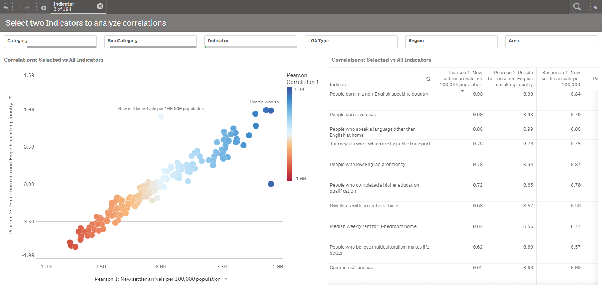

# Correlations

The correlation methods in this Server Side Extension (SSE) take in two columns of data and compute the linear correlation. 

The methods are implemented using Pandas, specifically the [pandas.DataFrame.corr](https://pandas.pydata.org/pandas-docs/stable/generated/pandas.DataFrame.corr.html) method.

## Why not just use the Qlik "Correl" function?

The Correl funtion is the simpler approach and will generally give you better performance. However, in certain cases this function may not be flexible enough. For example, if you have several series in your data and want to dynamically select one and calculate the correlations versus the others, you will find the out-of-the-box function is insufficient.

In addition, this SSE allows you to calculate three types of correlations: Pearson, Spearman Rank and Kendall Tau. 



## Quick Start

There are several methods for calculating correlation, but the most commonly used statistic is the Pearson r correlation coefficient. This can be calculated using the Pearson function with the syntax:

`<Analytic connection name>.Pearson([Series 1 as string], [Series 2 as string])`

The two series are passed an a concatenated string of values, which gives us flexibility in using the result against various dimensions and visualizations. The string should take the form of semi-colon separated values for example:

`PyTools.Pearson('10;12;14', '1;2;3')`

You can also use the Correlation function which takes in a third argument to specify the correlation type:

`<Analytic connection name>.Correlation([Series 1 as string], [Series 2 as string], 'Correlation Type')`

Possible values for the Correlation Type parameter are: 
- pearson
- spearman
- kendall

## Use Correlations in your own app

While the Correlation function is straight forward, you will need to set up a few expressions in Qlik to use it dynamically against multiple data series.

The [sample app](Sample_App_Correlations.qvf) can be used as a template for the instructions below.

In this app we have 194 different Indicators, with values and rankings for each Local Government Area (LGA) in Victoria, Australia. There are 79 LGAs, so each Indicator has a series of 79 values. 

Here's an expression to calculate the correlation of one specific Indicator versus all the others:

`PyTools.Correlation($(vSeriesInd1), $(vSeriesExcInd1), 'pearson')`

Plotted against the Indicator dimension, this gives us a correlation coefficient for each row.

The first variable in the expression remains constant for all Indicators, and is based on a selection. The second variable gives us a series for each value in the Indicator dimension. This is perhaps better understood by looking at the screenshot below:


`vSeriesInd1` is based on a third variable: `vIndicator1` which sets the Indicator dimension to the first value in the current selections:

`=SubField(Concat(Distinct [Indicator],';'),';',1)`

Let's take a closer look at the `vSeriesInd1`:

```
//vSeriesInd1
Keepchar(
	Concat(TOTAL
        Aggr(
            Only({$<[Profile Type] = {'LGA'}, [Indicator] = {"$(vIndicator1)"}>} ([LGA Name] & ':' & Value)), 
            (Indicator, (TEXT, ASCENDING)), ([LGA Name], (TEXT, ASCENDING))
            ) 
        , '; ')
	, '0123456789.;')
```

The inner Aggr function is restricted using set analysis and will always use the first Indicator value in the current selections based on `vIndicator1`. This Aggr function gives us the `[LGA Name] & ':' & Value` for each Indicator and LGA. We include the LGA name in order to sort the values consistently for all series. We include Indicator as well to remain consistent with the visualization's dimensions.

The Concat function then takes the multiple rows returned by the Aggr function and concatenates them into a string separated by semi-colons. By using `TOTAL` we can repeat this series across all Indicator values.

Finally we only keep numerical values and separators in our result. We do this at the end so that the Concat function maintains the desired sort order.

The result of all this can be seen in the top left table in the screenshot above.

The second variable `vSeriesExcInd1` has a similar expression, except that in this case it is based on the dimensional value of Indicator. 

```
//vSeriesExcInd1
Keepchar(
	Concat({$<[Indicator] = {*}>}
        Aggr(
            Only({$<[Profile Type] = {'LGA'}, [Correlation Relevant] = {'Yes'}, [Indicator]={*}-{"$(vIndicator1)"}>} ([LGA Name] & ':' & Value)), 
            (Indicator, (TEXT, ASCENDING)), ([LGA Name], (TEXT, ASCENDING))
            ) 
        , '; ')
    , '0123456789.;')
```

Here the set analysis in the Aggr function excludes the value of `vIndicator1` so that we are not calculating the correlation of the selected Indicator with itself. 

In the first sheet of sample app we have set up a Scatter Plot and a Table to visualize correlations for up to two selected Indicators. This is done with the expressions defined above, but with additional measures for the second selected Indicator. 

We have also defined measures for the Spearman Rank correlation which works well here when used with the Ranking instead of the Value.

`PyTools.Correlation($(vRanksInd1), $(vRanksExcInd1), 'spearman')`

These variables just use the Rank field instead of Value. 

Similary, these variables and expressions can be ported over to any data model that contains multiple indicators with series of values or rankings.
