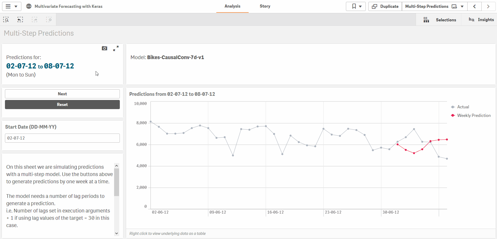
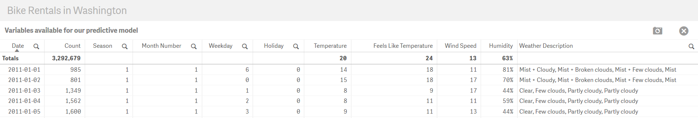
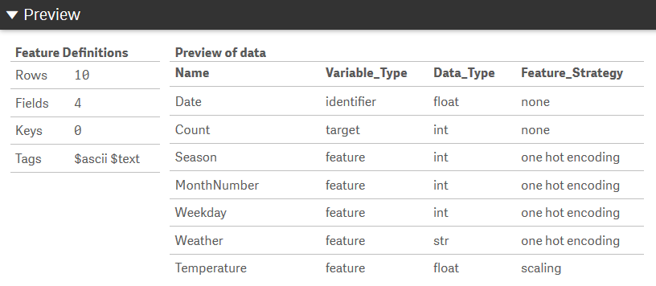
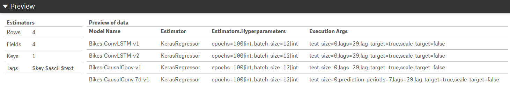

# Sequence Predictions with Keras & TensorFlow

## Table of Contents

- [Introduction](#introduction)
- [Deep Learning](#deep-learning)
     - [Sample Qlik Sense app](#sample-qlik-sense-app)
     - [Preparing data](#preparing-data)
     - [Preparing feature definitions](#preparing-feature-definitions)
     - [Setting up the model](#setting-up-the-model)
     - [Setting up the neural network](#setting-up-the-neural-network)
     - [Training the model](#training-the-model)
     - [Testing the model](#testing-the-model)
     - [Making predictions using the model](#making-predictions-using-the-model)
- [Sample Keras architectures](#sample-keras-architectures)
- [Input Specifications](#input-specifications)
- [Attribution](#attribution)

## Introduction

Many forecasting problems require more than the historical values of a time series to make accurate predictions. For example, when forecasting sales we can make better predictions by considering leads, opportunities and marketing campaigns. When forecasting solar power generation, we need to consider variables such as cloud cover and hours of daylight. Deep Learning offers us powerful capabilities for modelling such sequence prediction problems.

Deep learning models are capable of learning features from sequential data, can take in multiple input variables, and be set up to look at a certain number of periods, for instance 30 days, and make multi-step predictions, for example for the next 7 days. With Convolutional Neural Networks (CNNs) we have the capability to learn patterns from sequential data. And with Long Short Term Memory Networks (LSTMs) we can build models that retain information on long term dependencies. 

[Keras](https://keras.io/) is a Deep Learning library for Python which provides a high-level neural networks API, capable of running on top of [TensorFlow](https://www.tensorflow.org/), [CNTK](https://docs.microsoft.com/en-us/cognitive-toolkit/), or [Theano](http://www.deeplearning.net/software/theano/). 

This SSE provides functions for sequence predictions that use Keras and scikit-learn. We can set up our neural network's 'architecture', i.e. the inputs, hidden layers and outputs, and then train and test the model entirely through the Qlik load script. We can generate predictions by passing a configured number of lag periods to the model, either through the load script or through chart expressions. This implementation supports both regression and classification problems.

If you want to dive deeper into Deep Learning I recommend the following posts:
   - [The Unreasonable Effectiveness of Recurrent Neural Networks](http://karpathy.github.io/2015/05/21/rnn-effectiveness/)
   - [Understanding LSTM Networks](https://colah.github.io/posts/2015-08-Understanding-LSTMs/)
   - [How to Develop Deep Learning Models for Univariate Time Series Forecasting](https://machinelearningmastery.com/how-to-develop-deep-learning-models-for-univariate-time-series-forecasting/)
   - [Introduction to 1D Convolutional Neural Networks in Keras for Time Sequences](https://blog.goodaudience.com/introduction-to-1d-convolutional-neural-networks-in-keras-for-time-sequences-3a7ff801a2cf)
   - [Convolutions in Autoregressive Neural Networks](https://theblog.github.io/post/convolution-in-autoregressive-neural-networks/)

## Deep Learning
The steps to set up a Deep Learning model are very similar to those described under [Machine Learning with scikit-learn
](scikit-learn.md). In this SSE each step is carried out with the help of functions that provide a bridge between Qlik and the scikit-learn and Keras APIs. These functions are explained in the sections below.

At a high-level the steps are:
1. Prepare the features in Qlik
2. Prepare feature definitions in Qlik
3. Prepare the architecture for the neural network in Qlik
4. Setup the model with relevant parameters
   - `PyTools.sklearn_Setup(model_name, estimator_args, scaler_args, execution_args)`
   - `PyTools.sklearn_Setup_Adv(model_name, estimator_args, scaler_args, metric_args, dim_reduction_args, execution_args)`
5. Set feature definitions for the model
   - `PyTools.sklearn_Set_Features(model_name, feature_name, variable_type, data_type, feature_strategy, strategy_args)`
6. Set the Keras architecture for the model
   - `PyTools.Keras_Set_Layers(model_name, sort_order, layer_type, args, kwargs)`
7. Fit the model using the training data
   - `PyTools.sklearn_Fit(model_name, n_features)`
8. Calculate metrics on test data. In contrast to standard scikit-learn models, it is recommended to do this separate from training.
   - `PyTools.sklearn_Calculate_Metrics_Sequence(model_name, key, n_features)`
   - `PyTools.sklearn_Get_Confusion_Matrix(model_name)` _(Only applicable for classifiers)_
9. Get loss (error) per training epoch for the model. Plotting this data on a line chart gives an idea of how well the model is learning from the given data.
    - `PyTools.Keras_Get_History(model_name)`
10. Get predictions from an existing model.
      - `PyTools.sklearn_Predict_Sequence(model_name, key, n_features)` _(For use in chart expressions)_
      - `PyTools.sklearn_Bulk_Predict_Sequence(model_name, key, n_features)` _(For use in the load script)_
      - `PyTools.sklearn_Predict_Proba_Sequence(model_name, key, n_features)` _(For use in chart expressions. Only applicable to classifiers)_
      - `PyTools.sklearn_Bulk_Predict_Proba_Sequence(model_name, key, n_features)` _(For use in the load script. Only applicable to classifiers)_

Steps 1-9 are done through Qlik's data load script, while the predictions can be made through either the load script or in real-time using chart expressions.

Note that the `sklearn_Explain_Importances` function is currently not supported for Keras models.

### Sample Qlik Sense app

For the explanations below you can refer to [Sample-App-Forecasting-with-Keras](Sample-App-Forecasting-with-Keras.qvf) which trains four different models to predict bicycle rentals in Washington. The data source for this app can be found [here](bike-sharing/).

You will need to reload the app to train the models before you can use the last two sheets to make predictions.



### Preparing data
The first step is to gather the features (i.e. dimensions and measures in Qlik) that will help us predict the target. The target can be discrete labels for a classification problem, or a continuous variable for a regression problem. 

This is something where Qlik natively works well; bringing together data from multiple sources, deriving new dimensions and measures and structuring the data into a single table. This table should provide us one row for each sample, with columns for the target and all the features being provided to predict the target.

For sequence predictions you need to include a unique numerical identifier field, for example the date for daily data. This will be used to preserve the sequence of the data.

The first input to our model is this training dataset. You should hold back a portion of the data for testing.
   


### Preparing feature definitions

Next, for this implementation, we need to provide feature definitions for our dataset. This metadata can be brought into Qlik from any source such as a file or an internal table.

For each feature, i.e. each column in the dataset, we need to define the following attributes:

| Metadata field | Description | Valid values | Remarks |
| --- | --- | --- | --- |
| Name | A unique name for the feature | Any string | The feature name must be unique. |
| Variable Type | Identify whether the variable is a feature or target | `feature`, `target`, `excluded`, `identifier` | You need to specify an identifer which should be numerical and unique for each row. If using a date field you will need to convert it to a number using the `num` function in Qlik.<br><br>Features marked as `excluded` will be ignored. |
| Data Type | Used to covert the data to the correct type | `bool`, `int`, `float`, `str` | Specifying data types is necessary due to how data will be exchanged between Qlik and this SSE. |
| Feature Strategy | The feature preparation strategy | `one hot encoding`, `hashing`, `count_vectorizing`, `tf_idf`, `text_similarity`, `scaling`, `none` | Strings need to be converted to numerical values for machine learning. The strategies implemented in this SSE to do this are [one hot encoding](https://pandas.pydata.org/pandas-docs/stable/generated/pandas.get_dummies.html), [hashing](http://scikit-learn.org/stable/modules/generated/sklearn.feature_extraction.FeatureHasher.html), [count vectorizing](http://scikit-learn.org/stable/modules/generated/sklearn.feature_extraction.text.CountVectorizer.html), [TF-IDF vectorizing](http://scikit-learn.org/stable/modules/generated/sklearn.feature_extraction.text.TfidfVectorizer.html) and `text_similarity`. The latter is an approach developed in this SSE to convert strings to their unicode representation and then apply one hot encoding, creating one feature for each unique character in the column. This can be useful when similarity between strings is significant.<br><br>Numerical values generally need to be scaled to avoid bias towards larger numbers.<br><br>In general, for discrete values use OHE where the number of unique values is small, otherwise use hashing. For continuous values, use scaling. |
| Strategy Arguments | For `hashing`: the number of derived features.<br><br>For `count_vectorizing` and `tf_idf`: the keyword arguments that will be passed to the scikit-learn class | For `hashing` this should be an integer e.g. `4`<br><br>For `count_vectorizing` and `tf_idf` this should follow the syntax described under [Specifying keyword arguments for scikit-learn classes](##specifying-keyword-arguments-for-scikit-learn-and-keras) e.g. `'analyzer=char\|str, ngram_range=2;2\|tuple\|int'` | For hashing the integer should be a power of 2 for the algorithm to work correctly. |
   
The table should look like this:



### Setting up the model

The model is set up through the Qlik load script. You should familiarize yourself with the [LOAD...EXTENSION](https://help.qlik.com/en-US/sense/September2019/Subsystems/Hub/Content/Sense_Hub/Scripting/ScriptRegularStatements/Load.htm) syntax.

To set up the model we need to provide a model name and parameters for the estimator, scaler and the SSE itself. The input to the function `sklearn_Setup` is a table with one row and four columns: `Model_Name`, `EstimatorArgs`, `ScalerArgs`, `ExecutionArgs`.



While the parameters that can be passed here are explained in the [Input Specifications](#input-specifications), there are certain essential ones required for setting up a model for sequence predictions.

#### Estimaor

For regression use `KerasRegressor` and for classification use `KerasClassifier`.

#### Epochs and Batches

You need to specify the `epochs` and `batch_size` in the `EstimatorArgs` for each model. If you are unfamiliar with these concepts they are explained well [here](https://machinelearningmastery.com/difference-between-a-batch-and-an-epoch/). 

In short an epoch is a cycle in which the model is trained over the entire training set. Neural networks generally require hundreds of epochs for learning from a given dataset. In each epoch the model's weights will be updated after a batch of samples has been processed. The `batch_size` determines the size of each batch in an epoch.

#### Testing strategy

Next, in the `ExecutionArgs` you need to set the `test_size` to zero as it is recommended to do the testing separate to training so that we can use walk forward validation. If testing using cross validation you will need to pass the `time_series_split` argument with the number of splits, e.g. `time_series_split=3`. 

#### Lag observations

You also need to specify the lag periods which will be used to reshape the data, so that each sample shown to the model is composed of a number of lag observations. For example we can build a model that uses the previous 10 periods as input to make a prediction for the current period. 

*Note that you don't need to reshape the data in Qlik; the lag observations will be added by the SSE.*

You can also specify whether to use lag values of the target as an additional input feature which will be added by the SSE, and whether to scale the target. 

```
test_size=0, lags=29, lag_target=true, scale_target=false
```

In addition the `current_sample_as_input` parameter controls whether the model expects inputs (other than the target) for the current sample or will only use lag observations to make its predictions. This parameter is set to `true` by default.

#### Multi-step predictions

Finally, for multi-step predictions, for e.g. using the previous 30 days of inputs to produce a 7 day forecast, you can specify the prediction periods in the `ExecutionArgs` as well. 

```
test_size=0, prediction_periods=7, current_sample_as_input=false, lags=30, lag_target=true, scale_target=false
```

#### Model setup

In the sample app we set up a table `MODEL_INIT` to provide the input to our function.

The response is the model name, the result and a timestamp. If successful, this call will save the model to the path `../qlik-py-tools/qlik-py-env/models`.

```
[Result-Setup]:
LOAD
   model_name,
   result,
   timestamp
EXTENSION PyTools.sklearn_Setup(MODEL_INIT{Model_Name, EstimatorArgs, ScalerArgs, ExecutionArgs}); 
```

#### Feature definitions

We then send the feature definitions, i.e. the metadata on our features, to the model. In the sample script below the existing table `FEATURES` provides us the inputs: `Model_Name`, `Name`, `Variable_Type`, `Data_Type`, `Feature_Strategy`, `Strategy_Arguments`.

```
[Result-Setup]:
LOAD
   model_name,
   result,
   timestamp
EXTENSION PyTools.sklearn_Set_Features(FEATURES{Model_Name, Name, Variable_Type, Data_Type, Feature_Strategy, Strategy_Arguments});
```

### Setting up the neural network

The architecture of a neural network is defined by a number of layers that connect the input to the output. This SSE supports sequential Keras models which are a linear stack of layers.

Using Python we can define a Keras model in a few lines of code:

```
from keras.models import Sequential

model = Sequential()
model.add(Dense(units=64, activation='relu', input_shape=(100,)))
model.add(Dense(units=1, activation='softmax'))
model.compile(loss='binary_crossentropy', optimizer='sgd', metrics=['accuracy'])
```

This model has two Dense layers, the first with 64 nodes and the second with a single node which is the output. The input shape is 100 which means that we expect 100 features as input for each sample. The final line compiles the model for training.

To define the same model through this SSE we set up the architecture in the Qlik load script. We need to provide five fields: `Model Name`, `Sort Order`, `Layer Type`, `Args` and `Kwargs`. In addition, we need to specify the data type for each value in `Args` and `Kwargs` so we can convert these to the correct data type in Python. More details on this notation is available under the [Input Specifications](#input-specifications).

```
[Keras Architecture]:
LOAD * INLINE [
Model Name:Sort Order:Layer Type:Args:Kwargs
Dense-Net:1:Dense:64|int:input_shape=None|tuple|int, activation=relu|str
Dense-Net:2:Dense:1|int:activation=softmax|str
Dense-Net:3:Compilation::loss=binary_crossentropy|str, optimizer=sgd|str, metrics=accuracy|list|str
](delimiter is ':');
```


The final row in the architecture should be the compilation parameters for the model. The optimizer parameters can be customized by passing it as the second last row of the table. 

```
[Keras Architecture]:
LOAD * INLINE [
Model Name:Sort Order:Layer Type:Args:Kwargs
Dense-Net:1:Dense:64|int:input_shape=None|tuple|int, activation=relu|str
Dense-Net:2:Dense:1|int:activation=softmax|str
Dense-Net:3:Adam::lr=0.002|float
Dense-Net:4:Compilation::loss=binary_crossentropy|str, metrics=accuracy|list|str
](delimiter is ':');
```

For valid optimizers and relevant parameters refer to the Keras documentation [here](https://keras.io/optimizers/).

#### Input shape

Note that we passed the input shape as `None` in the example above. The SSE will calculate the final number of features after pre-processing the data, for e.g. by applying one hot encoding, and set this value for us. 

However, the number of dimensions in the input shape will depend on the Keras layer requirements. For example a Conv1D layer expects a 3D input of `(batch, steps, channels)`. We don't need to specify the batch in Keras, and the channels refer to the number of features which are calculated by the SSE. So in this case you only need to provide the value of the steps and a placeholder value for channels.

The values for dimensions other than the number of features depend on the `lags` and `current_sample_as_input` parameter set in the `ExecutionArgs`. 

For e.g. with `lags=29, current_sample_as_input=true`, we need the previous 29 samples and the current sample as input. So in this case we would have `input_shape=30;None|tuple|int`. With `lags=29, current_sample_as_input=false` we would have `input_shape=29;None|tuple|int`. 

The `lag_target` argument simply adds another feature to the inputs and does not affect the dimensions of the `input_shape` that need to be specified.

#### Output shape

You can build multi-step models by having more than one node in the final layer. You must pass the `prediction_periods` parameter to match this number of output nodes in the `ExecutionArgs`.

#### Table structure

A description of the fields required to define the Keras architecture is provided below. For sample architectures refer to [Sample Keras architectures](#sample-keras-architectures).

| Field | Description | Example | Remarks |
| --- | --- | --- | --- |
| Model_Name | Unique name for the model. This allows for multiple architectures to be defined in one table. | `Dense-Net` | The model will be stored to disk at `../qlik-py-tools/qlik-py-env/models`. |
| Sort_Order | Number to order the layers. | `1` | The compilation arguments should always be provided as a final 'layer'. |
| Layer_Type | Any valid Keras layer. | `Dense`, `LSTM`, `Conv1D`, `TimeDistributed Conv1D` | Refer to the [Keras documentation](https://keras.io/layers/about-keras-layers/) for more information.<br><br>For compilation parameters pass the `Layer_Type` as `compilation`.<br><br>Layer wrappers can be used by adding a space between the wrapper and the layer type e.g. `TimeDistributed Dense` |
| Args | Positional arguments for the layer. | `64\|int` | A layer may take in arguments which do not require a keyword, for e.g the number of nodes for a Dense layer. These can be provided through the `Args` column. The data type for the argument should be appended to the value using the `|` delimiter. |
| Kwargs | Keyword arguments for the layer. | `input_shape=30;None\|tuple\|int, activation=relu\|str` | A layer will take in several keyword arguments. You can provide these as `keyword1=value1\|type1, keyword2=value2\|type2...`. For lists, tuples and numpy arrays you can use the syntax `keyword=item1;item2;item3\|object_type\|value_type` and for dictionaries you can use `keyword=x:1;y:2\|dict\|key_type\|value_type`    |

### Training the model

To train the model we need to prepare a temporary table that concatenates all features into a single string. This is due to Qlik currently requiring a fixed number of parameters for SSE function calls.

This table can be set up easily in the load script by concatenating fields using `&` and the delimiter `|`. Note that the delimiter *must be* `|`.

Remember to include a numerical identifier field which can be used by the SSE for sorting the data. Also, you must provide the fields in exactly the same order as specified in the feature definitions.

```
// Set up a temporary table for the training and test dataset
[TEMP_TRAIN_TEST]:
LOAD
   num([Date]) & '|' &
   [Count] & '|' &
   [Season] & '|' &
   [Month Number] & '|' &
   [Weekday] & '|' &
   [Weather] & '|' &
   [Temperature] & '|' &
   [Feels Like Temperature] & '|' &
   [Humidity] & '|' &
   [Wind Speed] as N_Features
RESIDENT [day]
WHERE Split = 'Train';
```

Now we are ready to train the model. The inputs to `sklearn_Fit` is the table setup earlier with the addition of a field for the model name.

```
[TEMP_SAMPLES]:
LOAD
   '$(vModel)' as Model_Name,
   N_Features
RESIDENT [TEMP_TRAIN_TEST];

[Result-Fit]:
LOAD
   model_name,
   result as fit_result, 
   time_stamp as fit_timestamp, 
   score_result, 
   score
EXTENSION PyTools.sklearn_Fit(TEMP_SAMPLES{Model_Name, N_Features});
```

You will see the progress of the training in the SSE terminal with the loss for each epoch indicating the error over the entire training set. As the training proceeds you should see the loss reduce and then stabilize if your model has reached a limit in learning from the training set.

### Testing the model

For sequence prediction models we cannot use standard k-fold validation as we need to preserve order in the data. For this SSE, the recommended approach is to hold back a portion of the data, pass `test_size=0` in the `ExecutionArgs`, and use the `sklearn_Calculate_Metrics_Sequence` function to get evaluation metrics. 

The `sklearn_Calculate_Metrics` function takes in a new test dataset, with exactly the same features as the training data, and calculates the evaluation metrics. The Key field should be a unique numerical identifer that can be used to sort the data.

```
[Result-Metrics]:
LOAD *
EXTENSION PyTools.sklearn_Calculate_Metrics_Sequence(TEMP_SAMPLES_WITH_KEYS{Model_Name, Key, N_Features});
```

This function implements walk forward validation, which means that after each prediction we slide forward over the data by a given number of periods, and actual data for the previous periods is revealed to the model for use in the next prediction. This [blog post](https://machinelearningmastery.com/backtest-machine-learning-models-time-series-forecasting/) provides further explanation.

If using lag values of the target as inputs, we use earlier predictons as input for further predictions. Since in practice, we would be able to provide actual values to the model, the evaluation should be performed in batches over limited periods. For example, the sample app calculates metrics for one month of data at a time and then averages the results across 6 months. 

The approach is slightly different for multi-step predictions as the model is trained to make predictions for a fixed number of periods. In this case, we jump forward after each prediction period, and always use actual values for each prediction. In the sample app the `Bikes-CausalConv-7d-v1` model applies this method.

```
// Other than the multi-step model we get evaluation metrics and predictions one month at a time.
// Since past values are inputs to these models, predicting over long periods will add up the errors from previous predictions.
// In practice, we can continue to provide actual values to the model.
// So we are going to get predictions one month at a time, supplying actual values for previous periods.
For Each vMonth in 7, 8, 9, 10, 11, 12

   // Prepare samples table with the current model name and unique keys
   [TEMP_SAMPLES_WITH_KEYS]:
   LOAD
      '$(vModel)' as Model_Name,
      Key,
      N_Features // Including Target for historical data. Target may be Null or zero for the periods to be predicted
   RESIDENT [TEMP_TEST]
   WHERE [Key] >= (MonthStart(MakeDate(2012, $(vMonth), 1))-31) and [Key] <= MonthEnd(MakeDate(2012, $(vMonth), 1)); 

   // Use the LOAD...EXTENSION syntax to call the Get_Metrics function
   [Result-Metrics]:
   LOAD *,
         MonthName(MakeDate(2012, $(vMonth), 1)) as MonthName
   EXTENSION PyTools.sklearn_Calculate_Metrics_Sequence(TEMP_SAMPLES_WITH_KEYS{Model_Name, Key, N_Features});

   Drop table TEMP_SAMPLES_WITH_KEYS;

Next vMonth
```

An alternative method for testing, is to pass the `time_series_split` parameter in the `ExecutionArgs`. This will get the SSE to split the data into the given number of series while preserving order, and then use the scikit-learn `cross_validate` function to obtain evaluation metrics during the call to `sklearn_Fit`. However, these metrics will be based on the standard prediction function which cannot use previous predictions as inputs. In addition, this would train multiple models, one for each split and then a final model with all the data, which can be very time consuming for neural networks.

The `sklearn_Get_Metrics` function can be used if the model was evaluated using cross validation. This function only requires the model name as the input. 

```
[Result-Metrics]:
LOAD *
EXTENSION PyTools.sklearn_Get_Metrics(TEMP_SAMPLES{Model_Name});
```

#### Evaluation Metrics

The evaluation metrics available will depend on the testing method and whether the model is performing classification or regression. Refer to the table below for the output metrics.

| Model Type | Testing Method | Metrics | Remarks |
| --- | --- | --- | --- |
| Classification | Hold-out | `accuracy`, `precision`, `recall`, `fscore`, `support` | |
| Classification | Cross validation | `accuracy`, `precision`, `precision_std`, `recall`, `recall_std`, `fscore`, `fscore_std` | With cross validation, the metrics represent an average taken over subsets of data. The standard deviation helps indicate how actual performance of the model may vary on unseen data. |
| Regression | Hold-out | `r2_score`, `mean_squared_error`, `mean_absolute_error`, `median_absolute_error`, `explained_variance_score` | |
| Regression | Cross validation | `r2_score`, `r2_score_std`, `mean_squared_error`, `mean_squared_error_std`, `mean_absolute_error`, `mean_absolute_error_std`, `median_absolute_error`, `median_absolute_error_std`, `explained_variance_score`, `explained_variance_score_std` | With cross validation, the metrics represent an average taken over subsets of data. The standard deviation helps indicate how actual performance of the model may vary on unseen data. |

For classifiers you can also obtain a confusion matrix with the function `sklearn_Get_Confusion_Matrix`. For hold-out testing the matrix is calculated on the test dataset, while for cross validation the matrices are calculated for the test data in each fold and added up to give results across the entire training data.

```
[Result-ConfusionMatrix]:
LOAD *
EXTENSION PyTools.sklearn_Get_Confusion_Matrix(TEMP_SAMPLES{Model_Name});
```

#### Training History

You can obtain the training history for Keras models using the `Keras_Get_History` function. This function takes in the model name and returns the loss per epoch for the model recorded during model training. For more information on interpreting learning curves refer to this [post](https://machinelearningmastery.com/learning-curves-for-diagnosing-machine-learning-model-performance/).

```
// Use the LOAD...EXTENSION syntax to call the Keras_Get_History function
[Result-Keras]:
LOAD *
EXTENSION PyTools.Keras_Get_History(TEMP_MODEL{Model_Name});
```

### Making predictions using the model

To make predictions you need to use a trained model. Trained models are found in the SSE under `../qlik-py-tools/qlik-py-env/models`.

#### Convenience Functions

A list of models can be obtained using the `sklearn_List_Models` function. The input to this function is a string to search for within the directory. You can also provide an empty string to get a list of all files.

This function is meant to be used in chart expressions, for example it can be used a measure in a text object with the following expression.

```
'$(=PyTools.sklearn_List_Models(''))'
```

To make predictions you must provide exactly the same features in exactly the same order as the training data. And as explained in the section above, all features need to be concatenated into a single string. To help with this the function `sklearn_Get_Features_Expression` provides the expression that can be added to a variable in the load script.

```
TEMP_MODEL:
LOAD * INLINE [
    'Model_Name'
    'HR-Attrition-LR'
];

[FEATURES_EXPRESSION]:
LOAD
	result as features_expression
EXTENSION PyTools.sklearn_Get_Features_Expression(TEMP_MODEL{Model_Name});

vFeaturesExpression = peek('features_expression', 0, 'FEATURES_EXPRESSION');

Drop tables TEMP_MODEL;
```

#### Sequence Predictions

Predictions for sequential data can be made in a chart expression using the `sklearn_Predict_Sequence` function. For classifiers you can use the `sklearn_Predict_Proba_Sequence` function to get the predicted class probabilities. 

The input to the function are the model name, a unique numerical identifier and the features. The features should include the identifier as well as the target if using `lag_target=True`. The target can be NULL or zero for future periods.

```
PyTools.sklearn_Predict_Sequence(
	'Bikes-CausalConv-v1', 
	num(Date), 
    num([Date]) & '|' & Count & '|' & Season & '|' & [Month Number] & '|' & Weekday & '|' & Weather & '|' & Temperature & '|' & [Feels Like Temperature] & '|' &  Humidity & '|' & [Wind Speed]
    )
// Count can be Null or zero for future periods. The predicted values from previous periods will then be used as input for further predictions.
```

_Note: As of the June 2018 release, the expression above can be used as a dimension in the table object, allowing you to make selections on the prediction results. However, the prediction expression should **not** be stored as a master item dimension as this can lead to unstable behavior._

Predictions can also be made in the load script using the `sklearn_Bulk_Predict` method. For classifiers you can also use the `sklearn_Bulk_Predict_Proba` function to get the predicted class probabilities.

The input to the bulk prediction functions are the model name, a unique numerical identifier and the features. The features should include the identifier as well as the target if using `lag_target=True`. The target can be NULL or zero for future periods. The key field is returned in the response and can be used to link the predictions to the data model.

```
// Prepare samples table with the current model name and unique keys
[TEMP_SAMPLES_WITH_KEYS]:
LOAD
   '$(vModel)' as Model_Name,
   Key,
   N_Features // Including Target for historical data. Target may be Null or zero for the periods to be predicted
RESIDENT [TEMP_TEST]
WHERE [Key] >= (MonthStart(MakeDate(2012, $(vMonth), 1))-31) and [Key] <= MonthEnd(MakeDate(2012, $(vMonth), 1));

// Use the LOAD...EXTENSION syntax to call the Bulk_Predict function
[Predictions]:
LOAD
   model_name,
   Date(key) as [Date],
   prediction
EXTENSION PyTools.sklearn_Bulk_Predict_Sequence(TEMP_SAMPLES_WITH_KEYS{Model_Name, Key, N_Features});
```

If using lag values of the target as inputs, we use earlier predictons as input for further predictions which can cause errors to add up over time. Since in practice, we would be able to provide actual values to the model, the predictions should be performed in batches over limited periods. For example, the sample app gets predictions in the load script for one month of data at a time. In the `Walk Forward Predictions` sheet the SSE produces 7 days of predictions. 

The approach is slightly different for multi-step predictions as the model is trained to make predictions for a fixed number of periods. In this case, we jump forward after each prediction period, and always use actual historical values for each prediction. For example, we can make predictions for a week, then jump ahead 7 days and use actual values for the previous week to make predictions for the next week. In the sample app the `Bikes-CausalConv-7d-v1` model applies this method in the load script and on the `Multi-Step Predictions` sheet.

## Sample Keras architectures

A key factor in getting good results from a neural network is the model architecture. While this often requires experimentation, you can get a good start by referring to published models. Keras provides several examples in its [documentation](https://keras.io/getting-started/sequential-model-guide/). 

The integration with this SSE has been build with sequence prediction and timeseries forecasting problems in mind. For such problems Convolutional Neural Networks (CNNs) and hybrid CNN and Long Short Term Memory networks (LSTMs) look most promising based on my research. Convolution, especially, seems to be key as stacking such layers helps identify higher level features in the time series across the lag observations. 

### Convolutional LSTM

Here is one Convolutional LSTM architecture used in the sample app. Note the lag settings and the input shape in the script below. 

Each sample is going to consist of 29 lag periods. An additional row of data is needed as we are using lag observations of the target, i.e. for the 29th row we need to look at the 30th row's target. Finally, since the `current_sample_as_input` parameter is set to `true` by default, we will use another row of data which will be the period for which we make the prediction. The input from Qlik will be 31 rows of data.

These 31 rows will be reshaped by the SSE to the input shape set in the first layer. In this case the data will be reshaped to three timesteps of ten steps each with n features. 

We use a TimeDistributed layer wrapper to add a time dimension to the 1D Convolutional layers which feeds into the LSTM layers. The final Dense layer has a single output node which will be the prediction for the last period in our input.

```
[Estimators]:
LOAD * INLINE [
Model Name;Estimator;Estimators.Hyperparameters;Execution Args
Bikes-ConvLSTM-v1;KerasRegressor;epochs=150|int, batch_size=14|int;test_size=0,lags=29,lag_target=true,scale_target=false
](delimiter is ';');

[Keras Architecture]:
LOAD * INLINE [
Model Name:Sort Order:Layer Type:Args:Kwargs
Bikes-ConvLSTM-v1:1:TimeDistributed Conv1D:100|int, 2|int:input_shape=3;10;None|tuple|int, activation=relu|str
Bikes-ConvLSTM-v1:2:TimeDistributed Conv1D:100|int, 2|int:activation=relu|str
Bikes-ConvLSTM-v1:3:TimeDistributed MaxPooling1D::pool_size=2|int
Bikes-ConvLSTM-v1:4:TimeDistributed Flatten::
Bikes-ConvLSTM-v1:5:LSTM:100|int:return_sequences=true|bool, activation=relu|str
Bikes-ConvLSTM-v1:6:LSTM:50|int:activation=relu|str
Bikes-ConvLSTM-v1:7:Dense:1|int:
Bikes-ConvLSTM-v1:8:Compilation::loss=mean_squared_error|str, optimizer=adam|str
](delimiter is ':');
```

The sample app includes another variant without the TimeDistributed layer wrapper. This model has three stacks of convolutional layers which can theoretically allow the model to learn higher level features from the inputs.

```
[Estimators]:
LOAD * INLINE [
Model Name;Estimator;Estimators.Hyperparameters;Execution Args
](delimiter is ';');

[Keras Architecture]:
LOAD * INLINE [
Model Name:Sort Order:Layer Type:Args:Kwargs
Bikes-ConvLSTM-v2:1:Conv1D:100|int, 2|int:input_shape=30;None|tuple|int, activation=relu|str
Bikes-ConvLSTM-v2:2:Conv1D:100|int, 2|int:activation=relu|str
Bikes-ConvLSTM-v2:3:MaxPooling1D::pool_size=2|int
Bikes-ConvLSTM-v2:4:Conv1D:100|int, 2|int:activation=relu|str
Bikes-ConvLSTM-v2:5:Conv1D:100|int, 2|int:activation=relu|str
Bikes-ConvLSTM-v2:6:MaxPooling1D::pool_size=2|int
Bikes-ConvLSTM-v2:7:Conv1D:100|int, 2|int:activation=relu|str
Bikes-ConvLSTM-v2:8:Conv1D:100|int, 2|int:activation=relu|str
Bikes-ConvLSTM-v2:9:MaxPooling1D::pool_size=2|int
Bikes-ConvLSTM-v2:10:LSTM:100|int:return_sequences=true|bool, activation=relu|str
Bikes-ConvLSTM-v2:11:LSTM:50|int:activation=relu|str
Bikes-ConvLSTM-v2:12:Dense:1|int:
Bikes-ConvLSTM-v2:13:Compilation::loss=mean_squared_error|str, optimizer=adam|str
](delimiter is ':');
```

### Causal CNN

We can introduce causality and autoregression into a neural network using causal convolution layers. This is obviously an important consideration in timeseries and sequence prediction models and the Causal CNN variants are our preferred models in the sample app.

The architecture below is inspired from the posts [here](https://theblog.github.io/post/convolution-in-autoregressive-neural-networks/) and [here](https://github.com/JEddy92/TimeSeries_Seq2Seq/blob/master/notebooks/TS_Seq2Seq_Conv_Intro.ipynb). Note the `padding` and `dilation_rate` arguments which set up this model to only apply 1D convolutions in the forward direction.

```
[Estimators]:
LOAD * INLINE [
Model Name;Estimator;Estimators.Hyperparameters;Execution Args
Bikes-CausalConv-v1;KerasRegressor;epochs=150|int, batch_size=14|int;test_size=0,lags=29,lag_target=true,scale_target=false
](delimiter is ';');

[Keras Architecture]:
LOAD * INLINE [
Model Name:Sort Order:Layer Type:Args:Kwargs
Bikes-CausalConv-v1:1:Conv1D:64|int, 2|int:input_shape=30;None|tuple|int, padding=causal|str, dilation_rate=1|int, activation=relu|str
Bikes-CausalConv-v1:2:Conv1D:64|int, 2|int:padding=causal|str, dilation_rate=2|int, activation=relu|str
Bikes-CausalConv-v1:3:Conv1D:64|int, 2|int:padding=causal|str, dilation_rate=4|int, activation=relu|str
Bikes-CausalConv-v1:4:Conv1D:64|int, 2|int:padding=causal|str, dilation_rate=8|int, activation=relu|str
Bikes-CausalConv-v1:5:Conv1D:64|int, 2|int:padding=causal|str, dilation_rate=16|int, activation=relu|str
Bikes-CausalConv-v1:6:Flatten::
Bikes-CausalConv-v1:7:Dense:512|int:activation=relu|str
Bikes-CausalConv-v1:8:Dense:256|int:activation=relu|str
Bikes-CausalConv-v1:9:Dropout:0.2|float:
Bikes-CausalConv-v1:10:Dense:1|int:
Bikes-CausalConv-v1:11:Compilation::loss=mean_squared_error|str, optimizer=adam|str
](delimiter is ':');
```

### Multi-Step Causal CNN

The final model in the sample app is set up to take 30 days of input and return 7 days of predictions. Note the `prediction_periods=7` argument in the `ExecutionArgs` and the 7 nodes in the final layer. 

Also note the `current_sample_as_input=false` argument which sets up this model to only use lag observations as inputs. This lets us define models where we have no future information on any of the input variables.

```
[Estimators]:
LOAD * INLINE [
Model Name;Estimator;Estimators.Hyperparameters;Execution Args
Bikes-CausalConv-7d-v1;KerasRegressor;epochs=150|int, batch_size=14|int;test_size=0,prediction_periods=7,current_sample_as_input=false,lags=30,lag_target=true,scale_target=false
](delimiter is ';');

[Keras Architecture]:
LOAD * INLINE [
Model Name:Sort Order:Layer Type:Args:Kwargs
Bikes-CausalConv-7d-v1:1:Conv1D:64|int, 2|int:input_shape=30;None|tuple|int, padding=causal|str, dilation_rate=1|int, activation=relu|str
Bikes-CausalConv-7d-v1:2:Conv1D:64|int, 2|int:padding=causal|str, dilation_rate=2|int, activation=relu|str
Bikes-CausalConv-7d-v1:3:Conv1D:64|int, 2|int:padding=causal|str, dilation_rate=4|int, activation=relu|str
Bikes-CausalConv-7d-v1:4:Conv1D:64|int, 2|int:padding=causal|str, dilation_rate=8|int, activation=relu|str
Bikes-CausalConv-7d-v1:5:Conv1D:64|int, 2|int:padding=causal|str, dilation_rate=16|int, activation=relu|str
Bikes-CausalConv-7d-v1:6:Flatten::
Bikes-CausalConv-7d-v1:7:Dense:512|int:activation=relu|str
Bikes-CausalConv-7d-v1:8:Dense:256|int:activation=relu|str
Bikes-CausalConv-7d-v1:9:Dropout:0.2|float:
Bikes-CausalConv-7d-v1:10:Dense:7|int:
Bikes-CausalConv-7d-v1:11:Compilation::loss=mean_squared_error|str, optimizer=adam|str
](delimiter is ':');
```

## Input Specifications

This sections provides the specific syntax required for arguments to the `sklearn` and `keras` functions. 

In general, arguments are passed as strings to this SSE using the syntax `argument=value`. Multiple arguments within a string have to be separated by a comma, with single quotes around the entire string. For example:

```
// Set up a variable for execution parameters
LET vExecutionArgs = 'overwrite=true,test_size=0,lags=30,lag_target=true,debug=true';
```

### Specifying keyword arguments for scikit-learn and Keras

Many of the functions defined in this SSE accept additional keyword arguments for the relevant scikit-learn or Keras class. You should refer to the [scikit-learn](http://scikit-learn.org/stable/modules/classes.html#api-reference) and [Keras](https://keras.io/models/sequential/) APIs for documentation on the parameters available for each class or layer.

For the simple data types `bool`, `int`, `float`, and `str`, the format for such keyword arguments must take the form `arg=value|type`. Such arguments can be combined into a single string with the named parameters described in the sections below. For example:

```
'scaler=StandardScaler, with_mean=true|bool, with_std=true|bool' 
```

In addition this SSE accepts lists, arrays and tuples with the syntax `arg=item1;item2;item3|object_type|value_type`. For example:

```
'arg=1;2;3|list|int'
'arg=x;y;z|array|str'
'arg=0;1|tuple|int'
```

Finally dictionaries are accepted with the syntax `arg=x:1;y:2|dict|key_type|value_type`. For example:

```
'arg=x:1;y:2|dict|str|int'
```

### Execution Arguments

These arguments define the flow for the model. These settings are made once during the model setup and apply to subsequent calls to the model where relevant.

| Keyword | Description | Sample Values | Remarks |
| --- | --- | --- | --- |
| overwrite | Specify whether any existing model with the same name should be overwritten | `true`, `false` | Defaults to `true`. |
| test_size | Set the ratio that will be used to split the samples into training and testing data sets | `0.3`, `0` | Defaults to `0.33`. It is recommended to set this to `0` when using sequence predictions and use a separate call with test data for evaluation.<br><br>Refer to the [Testing the model](#testing-the-model) section for further explanation. |
| time_series_split | Enable cross validation | `3` | Defaults to `0` in which case the hold-out testing strategy is used as per `test_size`. <br><br>The value represents the time series splitting strategy as defined in the scikit-learn [TimeSeriesSplit class](https://scikit-learn.org/stable/modules/generated/sklearn.model_selection.TimeSeriesSplit.html). <br><br>Refer to the [Testing the model](#testing-the-model) section for further explanation. |
| lags | Add the given number lag observations to each sample. | `30` | This is a key parameter for Keras models and can be used to frame timeseries and sequence prediction problems into 3D or 4D data required for deep learning. For e.g. if lags=10, features from the previous ten samples will be concatenated as input features for the current sample. <br><br>An identifier field must be included in the feature definitions to correctly sort the data for this capability.<br><br>Defaults to zero lags. |
| lag_target | Include targets in the lag observations | `true` | Defaults to `false`.<br><br>If True an additional feature will be created for each sample using the previous value of the target. This is a key input for autoregressive models. <br><br>Note that setting this to true will mean that an additional row of input data is required. For example, with 29 lags the 29th row will need to refer to the 30th row's target. |
| scale_target | Scale the target before fitting | `true` | Defaults to `false`.<br><br>The scaling will be inversed so that predictions are returned in the original scale. |
| make_stationary | Make the target series more stationary | `log` | Valid values are `log` in which case we apply a logarithm to the target values, or `difference` in which case we transform the targets into variance from the previous value. The transformation will be reversed before returning predictions. |
| current_sample_as_input | Specify if the current sample should be used as input to the model | `false` | Defaults to `true`.<br><br>Setting this to `false` allows for models that only use lag observations to make future predictions. |
| prediction_periods | Specify the number of predictions expected from the model | `7` | Defaults to `1`.<br><br>This can be used to get a model to predict the next m periods given inputs for the previous n periods. This is only valid for Keras models which have a final output layer with more than one node. |
| random_state | Seed used by the random number generator when generating the training testing split | `42` | Defaults to `42`.<br><br>Must be an integer. |
| compress | Compression level between 1-9 used by joblib when saving the model | `1` | Defaults to `3`. |
| retain_data | Flag to determine if the training and test data should be saved in the model | `true`, `false` | Defaults to `false` as this adds to the size of the model on disk. |
| debug | Flag to output additional information to the terminal and logs | `true`, `false` | Defaults to `false`.<br><br>Information will be printed to the terminal as well to a log file: `qlik-py-tools\qlik-py-env\core\logs\SKLearn Log <n>.txt`. |

### Scaler Arguments

These arguments specify how numerical data will be standardized before being sent to the machine learning algorithm. Standardization of the data is a common requirement for machine learning algorithmns and helps avoid bias. If you want to use default values you can simply pass an empty string for `ScalerArgs` when setting up the model.

In this implementation we use the [sklearn.preprocessing](http://scikit-learn.org/stable/modules/preprocessing.html) package for scaling data.

| Keyword | Description | Sample Values | Remarks |
| --- | --- | --- | --- |
| scaler | scikit-learn class that will be used for scaling numeric data | `StandardScaler`, `MinMaxScaler`, `MaxAbsScaler`, `RobustScaler`, `QuantileTransformer` | Defaults to `StandardScaler`.<br><br>Mandatory argument if the scaler arguments are not an empty string. |
| missing | Strategy to use for missing/null values | `mean`, `median`, `mode`, `zeros`, `none` | Defaults to `zeros`.<br><br>This setting only applies to numerical features. If you want Null values to be taken into consideration for text features, replace them with an appropriate string in Qlik. |
| scale_hashed | Whether to scale hashed features | `true`, `false` | Defaults to `true`.<br><br>At times machine learning requires trial and error. You may want to control this setting and see the impact on the results. |
| scale_vectors | Whether to scale count vectorized and TF-IDF vectorized features | `true`, `false` | Defaults to `true`.<br><br>Same as above. You may want to control this setting and see the impact on the results. |

In addition to the standard parameters above, you can provide any valid key word arguments accepted by the scikit-learn preprocesing class specified under the `scaler` argument above. Refer to the specifictions under [Specifying keyword arguments for scikit-learn classes](#specifying-keyword-arguments-for-scikit-learn-classes)

For more information on available parameters refer to the [scikit-learn API](http://scikit-learn.org/stable/modules/classes.html#module-sklearn.preprocessing).

### Estimator Arguments

For Keras you can use `KerasRegressor` for regression problems and `KerasClassifier` for classification problems. Valid arguments are this for the Keras fit method documented [here](https://keras.io/models/sequential/).

Additional arguments for the estimator should be included in the `estimator_args` string when calling the `PyTools.sklearn_Setup` or `PyTools.sklearn_Setup_Adv` functions. The syntax for this is described under [Specifying keyword arguments for scikit-learn and Keras](#specifying-keyword-arguments-for-scikit-learn-and-keras). 

### Metrics Arguments

Model evaluation metrics are calculated by the `PyTools.sklearn_Fit` and `PyTools.sklearn_Calculate_Metrics_Sequence` functions. 

For classification, metrics are calculated using the scikit-learn class [metrics.precision_recall_fscore_support](http://scikit-learn.org/stable/modules/generated/sklearn.metrics.precision_recall_fscore_support.html). The accuracy is calculated using the [metrics.accuracy_score](https://scikit-learn.org/stable/modules/generated/sklearn.metrics.accuracy_score.html) method. When using cross validation the metrics are calculated using the methods [precision_score](http://scikit-learn.org/stable/modules/generated/sklearn.metrics.precision_score.html), [recall_score](http://scikit-learn.org/stable/modules/generated/sklearn.metrics.recall_score.html), [f1_score](http://scikit-learn.org/stable/modules/generated/sklearn.metrics.f1_score.html).

For regression, metrics are calculated using [metrics.r2_score](https://scikit-learn.org/stable/modules/generated/sklearn.metrics.r2_score.html), [metrics.mean_squared_error](http://scikit-learn.org/stable/modules/generated/sklearn.metrics.mean_squared_error.html), [metrics.mean_absolute_error](http://scikit-learn.org/stable/modules/generated/sklearn.metrics.mean_absolute_error.html), [metrics.median_absolute_error](http://scikit-learn.org/stable/modules/generated/sklearn.metrics.median_absolute_error.html), [metrics.explained_variance_score](http://scikit-learn.org/stable/modules/generated/sklearn.metrics.explained_variance_score.html). 

Arguments for the metrics other than those coming from the estimator's `score` method can be provided by using the `PyTools.sklearn_Setup_Adv` function instead of the standard `PyTools.sklearn_Setup` function.

```
[Result-Setup]:
LOAD
   model_name,
   result,
   timestamp
EXTENSION PyTools.sklearn_Setup_Adv(MODEL_INIT{Model_Name, EstimatorArgs, ScalerArgs, MetricArgs, DimReductionArgs, ExecutionArgs}); 
```

Metric arguments should be specified as a string using the syntax described under [Specifying keyword arguments for scikit-learn and Keras](#specifying-keyword-arguments-for-scikit-learn-and-keras).

## Attribution
The data used in the sample app was obtained from https://www.kaggle.com:
- [Bike Sharing in Washington D.C. Dataset](https://www.kaggle.com/marklvl/bike-sharing-dataset)
