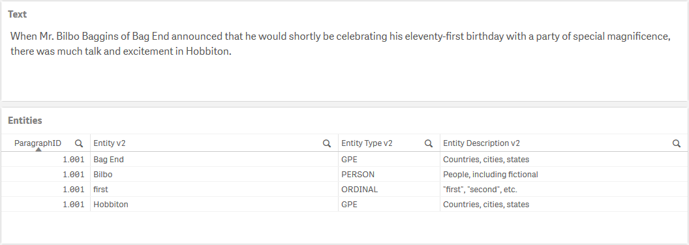
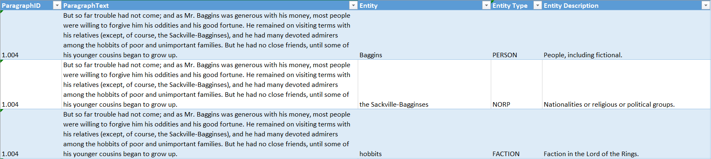
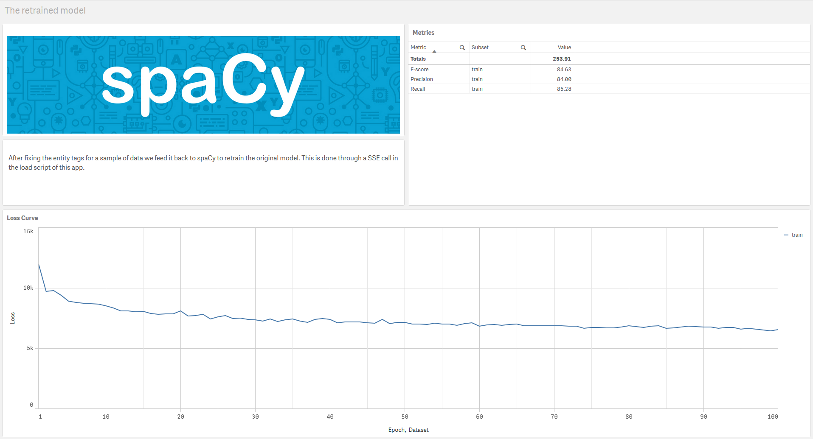

# Named Entity Recognition with spaCy

## Table of Contents

- [Introduction](#introduction)
- [Default Model](#default-model)
- [Quick Start](#quick-start)
- [Retraining a model](#retraining-a-model)
- [NER with a retrained model](#ner-with-a-retrained-model)
- [Additional Parameters](#additional-parameters)

## Introduction

Named Entity Recognition (NER) is used to identify and categorize entities in text. For example, NER can be used to identify people and places mentioned in a document.

[spaCy](https://spacy.io/) is an open-source library for advanced Natural Language Processing in Python. It provides pre-trained models for NER, and since these models are neural networks they can easily be improved upon by retraining them with your own data.

This Server-Side Extension (SSE) provides methods to extract entities using spaCy models, as well to retrain a model with your own data.



## Default Model

PyTools comes with the English language model `en_core_web_sm` installed.  You can add other models to the installation by editing the `Qlik-Py-Init.bat` file and then running it to initialize the SSE. You can more about the models available with spaCy [here](https://spacy.io/models).

## Quick Start

To extract entities with the default model we need to prepare a table in Qlik with a key, the text and any additional arguments to be passed to the SSE.

```
// Set up a temporary table that will be used as input to the SSE
[Texts]:
LOAD
    ParagraphID as key,
    ParagraphText as text,
    'debug=false' as args   
RESIDENT Paragraphs;
```

We can then call the SSE function `spaCy_Get_Entities` to get the entities, their types and description together with the key so we can link the entities back to our data model in Qlik.

```
// Use the LOAD...EXTENSION syntax to call the spaCy_Get_Entities function
[Named Entities]:
LOAD 
    key as ParagraphID,
    entity as [Entity],
    type as [Entity Type],
    description as [Entity Type Description]
EXTENSION PyTools.spaCy_Get_Entities(Texts{key, text, args});
```

## Retraining a model

To retrain a model, we need to prepare training samples. According to the folks at spaCy, a few hundred is a good start, but more is better. In my experience, if memory is more important than generalization, you can get away with fewer examples.

Qlik can be useful in identifying samples where the model performed especially bad, and then exporting these samples for re-labelling.

The training process uses Deep Learning; comparing the model's predictions to your manually labelled data to give feedback to the model which it then uses to update its internal parameters. If that sounded interesting there's a more detailed explanation [here](https://spacy.io/usage/training).

The training data needs to be prepared with the following fields:

| Column | Description | Notes | Example |
| --- | --- | --- | --- |
| text | The text to be analyzed for entities | Any text such as a sentence or paragaph. | `Frodo felt sleep coming upon him, even as Gildor finished speaking. 'I will sleep now,' he said; and the Elf led him to a bower beside Pippin, and he threw himself upon a bed and fell at once into a dreamless slumber.` |
| entity | An entity in the text | Any word or contiguous set of words in the text. The entity must match the instance in the text exactly. | `Frodo`
| entity_type | The category for the entity | One of the [default annotations](https://spacy.io/api/annotation#named-entities) for the spaCy model, or a new entity type.<br><br>If the entity is repeated in the text it will be taken to mean the same thing. Use multiple samples to train the model on an entity that can fit different categories.<br><br>If introducing a new entity you will need to consider that there are enough samples for the model to learn | `FACTION` |
|model_name | The name of the retrained model | The retrained model will be saved to disk. You will need this name to use the model for NER | `LOTR-v1` |
|args | Additional arguments for the SSE | A string containing the key word arguments for the SSE function call. A full list of possible arguments is provided under [Additional Parameters](#additional-parameters). | `'debug=true, epochs=100, drop=0.25, test=0.3'` |

Here's an example of what that would look like:



You then load your training data into a Qlik app:

```
// Prepare the training data
[Train]:
LOAD
    ParagraphID as sample_id,
    ParagraphText as text,
    Entity as entity,
    "Entity Type" as entity_type,
    'LOTR-v1' as model_name, 
    'debug=true, epochs=100, drop=0.25, test=0.3' as args
FROM [lib://AttachedFiles/LOTR-Training-Data.xlsx]
(ooxml, embedded labels, table is [Training Set]);
```
And then call the `spaCy_Retrain` function to trigger the learning process:

```
// Use the LOAD...EXTENSION syntax to call the spaCy_Retrain function
[Training Metrics]:
LOAD 
    model_name,
    subset,
    metric,
    value
EXTENSION PyTools.spaCy_Retrain(Train{text, entity, entity_type, model_name, args});
```
The function call returns a table with certain evaluation metrics like precision, recall and F-score. It also provides the loss at each epoch in the training which can be used to plot a loss curve.



## NER with a retrained model

Once you have retrained a model you can use it for entity recognition. For this you can use the `spaCy_Get_Entities_From_Model` function, providing a table with the key, text, model name and additional parameters as input.

If you introduced new entity types during model retraining, the model will not be able to provide an entity type description. However, this can be handled in Qlik by setting up a mapping table for the new entity types, and then using the standard `ApplyMap` function in the load from the SSE as shown below.

```
// Set up a temporary table that will be used as input to the SSE
[Texts]:
LOAD
    ParagraphID as key,
    ParagraphText as text,
    'LOTR-v1' as model_name,
    'debug=false, custom=true' as args   
RESIDENT Paragraphs;

// Create a mapping to get descriptions for custom entity types
[MapDesc]:
Mapping LOAD * INLINE [
    entity type, description
    FACTION, A faction in Middle-Earth
];

// Use the LOAD...EXTENSION syntax to call the spaCy_Get_Entities_From_Model function
[Named Entities v2]:
LOAD 
    key as ParagraphID,
    entity as [Entity v2],
    type as [Entity Type v2],
    ApplyMap('MapDesc', type, description) as [Entity Description v2]
EXTENSION PyTools.spaCy_Get_Entities_From_Model(Texts{key, text, model_name, args});
```

## Additional Parameters

The additional arguments provided through the last parameter in the input table lets you control the behavior of the SSE functions.

These arguments can be included in the final string parameter for the function using the syntax: `keyword=value`. Separate arguments with a comma and use single quotes around the entire string. e.g. `'debug=true, epochs=100, drop=0.25, test=0.3'`

| Keyword | Description | Sample Values | Remarks |
| --- | --- | --- | --- |
| debug | Flag to output additional information to the terminal and logs. | `true`, `false` | Information will be printed to the terminal as well to a log file: `..\qlik-py-env\core\logs\spaCy Log <n>.txt`. |
| base_model | The base model to be retrained. | `en_core_web_sm`, `LOTR-v1` | This can be a standard spaCy model or a previously retrained model. The standard spaCy model needs to have been installed during the SSE setup. |
| custom | Set whether the model (if getting named entites) or base model (if retraining) is a custom model, i.e. not one of the pre-trained models provided by spaCy | `true`, `false` | This is used to load the model from the correct location. |
| blank | Set the retraining to be done on a blank Language class | `true`, `false` | This SSE comes with the `en` language by default, but this can be changed in the `Qlik-Py-Init.bat` file before setup. |
| epochs | This is the the number times that the learning algorithm will work through the entire training dataset. | `100`, `200` | The default value is set to `100`. |
| batch_size | Set the batch size to be used during model training. The model's internal parameters will be updated at the end of each batch. | `16`, `4.0;32.0;1.001|list|float` | This can be an integer for a fixed batch size or a list of numbers for compounding or decaying batches.<br><br> For compounding and decaying batches refer to the [spaCy API](https://spacy.io/api/top-level#util.compounding) for what the three numbers represent. Separate numbers with a `;` and add `|list|float` in the end to allow the SSE to interpret the data type. |
| drop | Set the dropout rate for retraining the model. This determines the likelihood that a feature or internal representation in the model will be dropped, making it harder for the model to memorize the training data. | `0.5`, `0.25` | Valid values are a number less than 1 and greater than 0. The default value is set to `0.25`. |
| test | Set the ratio of data to be used for testing. This data will be held out from training and just used to provide evaluation metrics. | `0.33`, `0.4` | The default value is set to `0` so that all data will be used for training. |