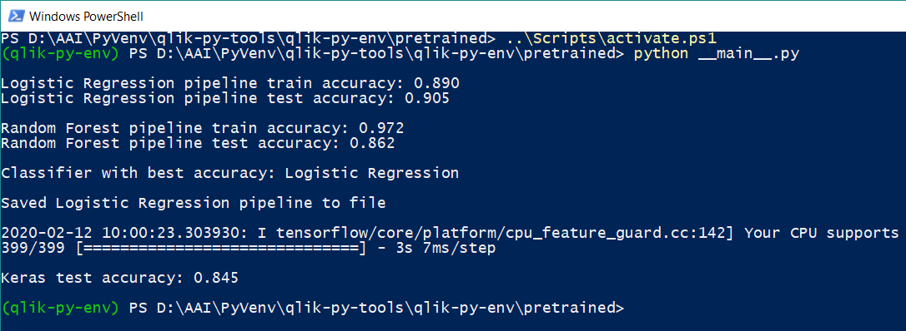

# Calling existing Machine Learning models

## Table of Contents

- [Introduction](#introduction)
- [Pre-requisites](#pre-requisites)
- [Setting up the model](#setting-up-the-model)
- [Calling the model](#calling-the-model)
    - [Building the features expression](#building-the-features-expression)
    - [What-if analysis](#what-if-analysis)
- [Additional functionality](#additional-functionality)
    - [Specifying the prediction function](#specifying-the-prediction-function)
    - [Sequential or ordered data](#sequential-or-ordered-data)
    - [Mapping predictions to text labels](#mapping-predictions-to-text-labels)
    - [Debugging](#debugging)
- [Complete Example](#complete-example)
- [Notes for Developers](#notes-for-developers)
- [Attribution](#attribution)

## Introduction

This Server Side Extension (SSE) can be used to call existing Machine Learning (ML) models. Predictions can be obtained through the Qlik load script or chart expressions. 

This capability enables you to deliver ML models in business focused Qlik apps. Predictions can be delivered within broader analysis and in the context of user selections. User controls in Qlik Sense can be used together with this capability to enable what-if analysis using the ML model.

This SSE also provides capabilities for training machine learning models entirely through the Qlik load script. This can be convenient for running experiments without writing any Python code. These capabilities are covered under the [Machine Learning](scikit-learn.md) and [Advanced Forecasting](Keras.md) sections.

## Pre-requisites

- This SSE supports REST API based models, as well as scikit-learn and Keras models that have been saved to disk.
- Keras and scikit-learn models need to be built with the same version of Python that is being used by the SSE (3.6.x). 
- scikit-learn models need to be saved using the Pickle library.
- Keras models need to be saved using the Keras model.save method.
- The scikit-learn and Keras version used to build the model needs to match the SSE.
- Preprocessing (e.g. scaling, OHE) needs to be handled by the model / pipeline.

## Setting up the model

This SSE will handle the communication between Qlik and Python and call the specified model. However, we need certain details for the model to translate the incoming data and call the model correctly. This information has to be supplied through a YAML file.

The YAML file needs to be placed in the SSE's `qlik-py-env/models` directory. The tags available for defining a model are provided below:

| Tag | Scope | Description | Sample Values | Remarks |
| --- | --- | --- | --- | --- |
| **path** | Mandatory | Relative or absolute path to the model | `../pretrained/HR-Attrition-v1.pkl`<br><br>`http://xxx:123/public/api/v1/model/predict` | This will be a URL if the model is exposed through a REST API. |
| **type** | Mandatory | Type of the model | `scikit-learn`, `sklearn`, `keras`, `rest` | Currently this SSE only supports scikit-learn, Keras and REST API based models. |
| **response_section** | Optional. Only applicable for REST. | Defines the section of the JSON response that will be returned to Qlik | `result` | A JSON response will typically contain several sections under the root. This tag can be used to specify the section which contains the predictions to be returned to Qlik. |
| **user** | Optional. Only applicable for REST. | Used to pass the endpoint key or user in the REST call | `qlik` | Note that this SSE does not handle encryption of the YAML file on disk. |
| **password** | Optional. Only applicable for REST. | Used to pass the password in the REST call | `password` | Note that this SSE does not handle masking of the password or encryption of the YAML file on disk. |
| **payload_header** | Optional. Only applicable for REST. | Used to nest the data/payload within a section of the JSON request | `features` | A REST API may require the JSON payload in the request to be contained within a parent object, e.g. `features`. |
| **preprocessor** | Optional | Pickled preprocessor that will be called to prepare data for the model | `../pretrained/HR-Attrition-prep-v1.pkl` | This has to be a path to a Python object that implements the `transform` method and has been stored using `Pickle`. The SSE will call the preprocessor's `transform` method on the samples received from Qlik and use its output to call the model's prediction function. |
| **features** | Mandatory | List of features expected by the model together with their data types | `overtime : str`<br><br>`salary : float` | The order of the features is important and needs to be followed by the model and the Qlik app calling the model.<br><br>The data types are required for correctly interpreting the data received from Qlik. Valid types are `int`, `float`, `str`, `bool`.<br><br>The names of the features should correspond to fields in the Qlik app.<br><br>Please refer to the examples below for formatting this list. |

Here is a sample YAML file for a scikit-learn model. You can also find complete examples [here](sample-scripts/HR-Attrition-v1.yaml) and [here](sample-scripts/HR-Attrition-v2.yaml).

```
---
path: ../pretrained/HR-Attrition-v1.pkl
type: sklearn
features:
    overtime : str
    salary : float
...
```
Here is a sample YAML file for a deployed model that is exposed via a REST API.
```
---
path: http://xxx:123/public/api/v1/procedures/predict
type: rest
user: abc
response_section: result
payload_header: features
features:
    admit_date: str
    patient_status: str
    proc_date: str
    proc_desc: str
    surg_descrp: str
    surgery_type: str
...
```

## Calling the model

A model can be called through a Qlik chart expression using the following syntax:

```
// PyTools.Predict('model-name', [FeaturesExpression], 'kwarg=value,...')
PyTools.Predict('HR-Attrition-v1', FeaturesExpression, 'debug=false')
```

- The model name is the YAML file name excluding the file extension. 
- The FeaturesExpression is a string concatenation of all the fields that will be passed as features to the model. Field values need to be separated by the `|` delimiter. There is a convenience function that can be used to build this expression which is covered below.
- The final argument is a string of key word arguments. Possible options are covered under [Additional functionality](#additional-functionality).

The granularity of the chart object must match the level required by the model. For example predictions could be produced in a table object with each sample's key field as a dimension.

The model can also be called through the Qlik load script. This requires an additional `Key` field that is used to identify each record and can be used to link the predictions back to the data model.

```
// Set up the information required to get predictions from the model:
// Model Name: Name of the YAML containing the model specifications. 
// Key: A field that can be used to link the data to the Qlik data model.
// N_Features: A concatenated field providing input features for the model as specified in the YAML file.
// Kwargs: Additional key word arguments for the SSE.
TEMP_SAMPLES_WITH_KEYS:
LOAD
    'HR-Attrition-v1' as Model_Name,
    EmployeeNumber as Key,
    FeaturesExpression as N_Features,
    '' as Kwargs
RESIDENT [N_Features];

// Use the LOAD...EXTENSION syntax to call the Bulk_Predict function
[Predictions]:
LOAD
   model_name,
   key as EmployeeNumber,
   prediction
EXTENSION PyTools.Bulk_Predict(TEMP_SAMPLES_WITH_KEYS{Model_Name, Key, N_Features, Kwargs});

Drop table TEMP_SAMPLES_WITH_KEYS;
```

### Building the features expression
This SSE provides a convenience function to setup the features expression for Qlik based on the model's YAML file. This will only work if the feature names in the YAML file match the field names in Qlik.

This function can be called through the Qlik load script as shown below. You would do this prior to calling the model for predictions.

```
// Setup a temporary table with the model name.
// This should match the YAML file's name excluding the file extension.
TEMP_MODEL:
LOAD * INLINE [
    'Model_Name'
    'HR-Attrition-v1'
];

// Use a convenience function to get the features expression required by the model.
// This expression is based on the model specifications in the model's YAML file.
// The expression assumes that the field names in Qlik match the model specifications in the YAML file.
[FEATURES_EXPRESSION]:
LOAD
    result as features_expression
EXTENSION PyTools.Get_Features_Expression(TEMP_MODEL{Model_Name});

// Store the expression in a variable
vFeaturesExpression = peek('features_expression', 0, 'FEATURES_EXPRESSION');

Drop tables TEMP_MODEL, FEATURES_EXPRESSION;

// The Features Expression can be evaluated to obtain features concatenated into a single string as required by the SSE
[Samples]:
LOAD
    EmployeeNumber,
    $(vFeaturesExpression) as FeaturesExpression
RESIDENT [HR-Data];
```

With the `FeaturesExpression` field produced by this script, the model can be called through a simple chart expression:

```
PyTools.Predict('HR-Attrition-v1', FeaturesExpression, 'debug=false')
```

### What-if analysis

The features expression is simply a concatenation of fields in Qlik, so we can do what-if analysis by using variables to modify the value of the inputs. For example consider the partial expression below where variables are being applied to the `OverTime` and `PercentSalaryHike` features. 

```
...
    [Over18] &'|'& 
    //OverTime controlled by the vNoOvertime variable which is available in the app as buttons
    if('$(vNoOvertime)' = 'True', 'No', [OverTime]) &'|'& 
    //PercentSalaryHike replaced by the vMonthlyIncrease variable which is controlled by a slider
    $(vMonthlyIncrease) &'|'& 
    [PerformanceRating] &'|'& 
...
```

The variables can then be exposed to the user through input controls such as buttons and sliders. The model is called for a prediction every time the inputs change, and this allows the user to perform what-if analysis at a granular level. 

The complete feature expression can be built manually by contatenating the requried fields with the `|` delimiter, or by copying the value of the `vFeaturesExpression` variable setup by the convenience function described [above](#building-the-features-expression).

### Additional functionality

Additional functionality is controlled by key word arguments passed to this SSE as a string through the last parameter of the `Predict` and `Bulk_Predict` functions. 

The arguments are supplied in the syntax `argument=value`, multiple arguments separated by a comma, with single quotes around the entire string. For example:

```
// The final parameter of the function call is used to provide keyword arguments
PyTools.Predict('HR-Attrition-v1', FeaturesExpression, 'return=predict_proba, debug=true')
```

#### Specifying the prediction function

By default this SSE calls the `predict` function of the model. To specify any other valid function, for example `predict_proba`, you can use the `return` argument:

```
// Get prediction probabilities from a scikit-learn classifier
PyTools.Predict('HR-Attrition-v1', FeaturesExpression, 'return=predict_proba')
```

#### Sequential or ordered data

Certain models may take in sequential data, for example a timeseries. In this case the predictions may need to be generated in sequence and the order of the inputs is important. 

To handle this we need an identifier to be specified in the model's YAML file. The identifier will be used to sort the data from Qlik before it is passed to the model. The SSE then sorts the predictions back to the original order for the response to Qlik.

For example [this](sample-scripts/HR-Attrition-v2.yaml) YAML file includes the `EmployeeNumber` as a feature. 

```
---
path: ../pretrained/HR-Attrition-Keras-v1.h5
type: keras
preprocessor: ../pretrained/HR-Attrition-prep-v1.pkl
features:
    EmployeeNumber : int
    Age : int
    BusinessTravel : str
...
```

You can then specify the identifier through the `identifier` argument, and choose to exclude it from the features passed to the model by using the `exclude_identifier` argument. The former is the name of the feature as per the YAML file, and the latter is `true` or `false`.

```
PyTools.Predict('HR-Attrition-v2', FeaturesExpression2, 'identifier=EmployeeNumber, exclude_identifier=true')
```

#### Mapping predictions to text labels

In case of classification, a model may return a numerical class that needs to be mapped to a text label. This can be done by passing the `labels` argument. 

This argument takes the form of a dictionary in the syntax `'labels=0:x;1:y|dict|int|str'`. The key value pairs are separated by `:` and the items by `;`. The data types for the Python object, key and value need to be provided as well separated by the '|' delimiter.

For example, the argument below will map `0` to `No` and `1` to `Yes`.

```
=PyTools.Predict('HR-Attrition-v2', FeaturesExpression2, 'labels=0:No;1:Yes|dict|int|str, debug=true')
```

This capability requires the class output to be numeric and rounds floating point numbers to an integer.

#### Debugging

The `debug=true` argument will print information to the terminal and logs which can be helpful in understanding the steps being executed and in identifying problems. 

The log files can be found in the SSE's `qlik-py-env/core/logs` directory under the name `qlik-py-tools\qlik-py-env\core\logs\Common Functions Log <n>.txt`.

```
PyTools.Predict('HR-Attrition-v1', FeaturesExpression, 'debug=true')
```

### Complete Example

A complete example to generate sample scikit-learn and Keras models is available [here](sample-scripts/).

A [Jupyter notebook](sample-scripts/HR-Attrition-Model.ipynb) is available for reference. However, to generate the models and call them from Qlik you'll need to follow the steps below to ensure the models are compatible with the SSE. 

- Create a subdirectory called `pretrained` under your SSE's `qlik-py-env` directory. 
- Copy the `__main__.py` and `preprocessor.py` files from [here](sample-scripts/) to `qlik-py-env/pretrained`. 
- Copy the [data source](HR-Employee-Attrition.xlsx) to `qlik-py-env/pretrained`.
- Copy `HR-Attrition-v1.yaml` and `HR-Attrition-v2.yaml` from [here](sample-scripts/) to `qlik-py-env/models`. Note that these need to be placed in the `models` directory, not `pretrained`.
- Open a terminal in the `qlik-py-env/pretrained` directory and activate the Python virtual environment. For Windows you would open a PowerShell window and use the following command:
    ```
    ..\Scripts\activate.ps1
    ```
    Install the `xlrd` package that is not installed with the SSE. This is to allow Pandas to read from the Excel data source.
    ```
    pip install xlrd
    ```
    Then generate the models using `__main.py__`:
    ```
    python __main__.py
    ```
    

You can now use [Sample-App-Pretrained-Predict.qvf](Sample-App-Pretrained-Predict.qvf) to call these models. 

The app calls the models through chart expressions as well as the load script. For reloading the app with Qlik Sense Desktop, you will need to download the [data source](HR-Employee-Attrition.xlsx), create a data connection named `AttachedFiles` in the app, and point the connection to the folder containing the source file. This step is not required for Qlik Sense Enterprise as the data source is attached to the app.

### Notes for Developers

For developers interested in this implementation the flow is explained below. All files mentioned below are found under this project's `core` directory.

- `__main__.py` defines the gRPC service that provides capabilites to Qlik. The function definitions seen by Qlik are available in the `functions.json` file.
- The `functions` property in `__main__.py` maps the capabilities from the json file to various Python functions. In this case the capabilities map to the `_misc` function which in turn uses the `CommonFunction` class.
- The `CommonFunction` class in `_common.py` handles the interpretation of data from Qlik, the call to the model and preparation of the response.

## Attribution
The data used in the sample app was obtained from https://www.kaggle.com from the [Employee Attrition](https://www.kaggle.com/patelprashant/employee-attrition) dataset.