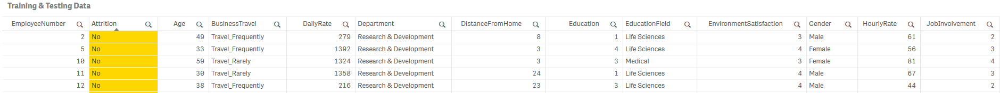
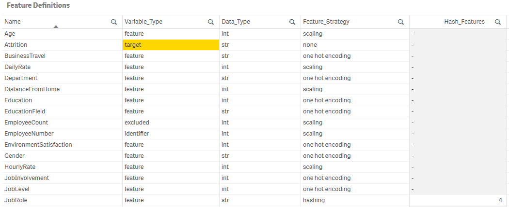

# Machine Learning with scikit-learn

## Table of Contents

- [Introduction](#introduction)
     - [Using pre-trained models in Qlik](#using-pre-trained-models-in-qlik)
- [Supervised Machine Learning](#supervised-machine-learning)
     - [Preparing data](#preparing-data)
     - [Preparing feature definitions](#preparing-feature-definitions)
     - [Setting up the model](#setting-up-the-model)
     - [Training and testing the model](#training-and-testing-the-model)
     - [Interpreting the Model](#interpreting-the-model)
     - [Making predictions using the model](#making-predictions-using-the-model)
- [Unsupervised Machine Learning](#unsupervised-machine-learning)
     - [Matrix Decomposition](#matrix-decomposition)
     - [Clustering](#clustering)
- [Additional Functionality](#additional-functionality)
     - [Optimizing hyperparameters for an estimator](#optimizing-hyperparameters-for-an-estimator)
     - [Training multiple estimators](#training-multiple-estimators)
     - [Out-of-core learning](#out-of-core-learning)
     - [Dimensionality reduction](#dimensionality-reduction)
- [Input Specifications](#input-specifications)
     - [Specifying keyword arguments for scikit-learn classes](#specifying-keyword-arguments-for-scikit-learn-classes)
     - [Execution Arguments](#execution-arguments)
     - [Scaler Arguments](#scaler-arguments)
     - [Estimator Arguments](#estimator-arguments)
     - [Grid Search Arguments](#grid-search-arguments)
     - [Metrics Arguments](#metrics-arguments)
     - [Dimensionality Reduction Arguments](#dimensionality-reduction-arguments)
- [Attribution](#attribution)

## Introduction

Supervised machine learning techniques make use of known samples to train a model, and then use this model to make predictions on new data. One of the best known machine learning libraries is [scikit-learn](http://scikit-learn.org/stable/index.html#), a package that provides efficient versions of a large number of well researched algorithms. A good introduction to machine learning and the scikit-learn API is available in [this excerpt from the Python Data Science Handbook](https://jakevdp.github.io/PythonDataScienceHandbook/05.01-what-is-machine-learning.html). 

This SSE provides functions to train, test and evaluate models and then use these models to make predictions. The implementation includes classification and regression algorithms.

In addition this SSE also implements the unsupervised machine learning algorithms available in scikit-learn. These include techniques for inferring structure in unlablelled data such as clustering and dimensionality reduction.

### Using pre-trained models in Qlik

This SSE also provides capability to get predictions from externally trained scikit-learn and Keras models. This capability is explained [here](Pretrained.md).

## Supervised Machine Learning
Machine learning problems can be broken down into general steps. In this SSE each step is carried out with the help of functions that provide a bridge between Qlik and the scikit-learn API. These functions are explained in the sections below.

At a high-level the steps are:
1. Prepare the features in Qlik
2. Prepare feature definitions in Qlik
3. Setup the model with relevant parameters
   - `PyTools.sklearn_Setup(model_name, estimator_args, scaler_args, execution_args)`
   - `PyTools.sklearn_Setup_Adv(model_name, estimator_args, scaler_args, metric_args, dim_reduction_args, execution_args)`
4. Optionally, setup a parameter grid to automate the optimization of hyperparameters
   - `PyTools.sklearn_Set_Param_Grid(model_name, estimator_args, grid_search_args)`
   - `PyTools.sklearn_Get_Best_Params(model_name)`
5. Set feature definitions for the model
   - `PyTools.sklearn_Set_Features(model_name, feature_name, variable_type, data_type, feature_strategy, strategy_args)`
6. Fit the model using the training data, and optionally evaluate it using test data
   - `PyTools.sklearn_Fit(model_name, n_features)`
   - `PyTools.sklearn_Partial_Fit(model_name, n_features)` _(Work in progress)_
7. Optionally, calculate metrics on test data if this was not done together with training
   - `PyTools.sklearn_Calculate_Metrics(model_name, n_features)`
   - `PyTools.sklearn_Get_Metrics(model_name)`
   - `PyTools.sklearn_Get_Confusion_Matrix(model_name)` _(Only applicable to classifiers)_
8. Optionally, calculate feature importances to gain a better understanding of the model
    - `PyTools.sklearn_Explain_Importances(model_name)`
9. Get predictions from an existing model
   - `PyTools.sklearn_Predict(model_name, n_features)` _(For use in chart expressions)_
   - `PyTools.sklearn_Bulk_Predict(model_name, key, n_features)` _(For use in the load script)_
   - `PyTools.sklearn_Predict_Proba(model_name, n_features)` _(For use in chart expressions. Only applicable to classifiers)_
   - `PyTools.sklearn_Bulk_Predict_Proba(model_name, key, n_features)` _(For use in the load script. Only applicable to classifiers)_

Steps 1-8 are done through Qlik's data load processes, while the predictions can be made through either the load script or in real-time using chart expressions.

### Preparing data
The first step is to gather the features (i.e. dimensions and measures in Qlik) that will help us predict the target. The target can be discrete labels for a classification problem, or a continuous variable for a regression problem. 

This is something where Qlik natively works well; bringing together data from multiple sources, deriving new dimensions and measures and structuring the data into a single table. This table should provide us one row for each sample, with columns for the target and all the features being provided to predict the target.

The first input to our model is this training dataset. If testing and evaluation needs to be done on the same dataset, this SSE can automate the process of splitting the data into training and testing subsets.
   


### Preparing feature definitions

Next, for this implementation, we need to provide feature definitions for our dataset. This metadata can be brought into Qlik from any source such as a file or an internal table.

For each feature, i.e. each column in the dataset, we need to define the following attributes:

| Metadata field | Description | Valid values | Remarks |
| --- | --- | --- | --- |
| Name | A unique name for the feature | Any string | The feature name must be unique. |
| Variable Type | Identify whether the variable is a feature or target | `feature`, `target`, `excluded`, `identifier` | Features marked as `excluded` or `identifier` will be ignored. |
| Data Type | Used to covert the data to the correct type | `bool`, `int`, `float`, `str` | Specifying data types correctly is necessary due to how data will be exchanged between Qlik and this SSE. |
| Feature Strategy | The feature preparation strategy | `one hot encoding`, `hashing`, `count_vectorizing`, `tf_idf`, `text_similarity`, `scaling`, `none` | Strings need to be converted to numerical values for machine learning. The strategies implemented in this SSE to do this are [one hot encoding](https://pandas.pydata.org/pandas-docs/stable/generated/pandas.get_dummies.html), [hashing](http://scikit-learn.org/stable/modules/generated/sklearn.feature_extraction.FeatureHasher.html), [count vectorizing](http://scikit-learn.org/stable/modules/generated/sklearn.feature_extraction.text.CountVectorizer.html), [TF-IDF vectorizing](http://scikit-learn.org/stable/modules/generated/sklearn.feature_extraction.text.TfidfVectorizer.html) and `text_similarity`. The latter is an approach developed in this SSE to convert strings to their unicode representation and then apply one hot encoding, creating one feature for each unique character in the column. This can be useful when similarity between strings is significant.<br><br>Numerical values need to be scaled to avoid bias towards larger numbers.<br><br>In general, for discrete values use OHE where the number of unique values is small, otherwise use hashing. For continuous values, use scaling. |
| Strategy Arguments | For `hashing`: the number of derived features.<br><br>For `count_vectorizing` and `tf_idf`: the keyword arguments that will be passed to the scikit-learn class | For `hashing` this should be an integer e.g. `4`<br><br>For `count_vectorizing` and `tf_idf` this should follow the syntax described under [Specifying keyword arguments for scikit-learn classes](#specifying-keyword-arguments-for-scikit-learn-classes) e.g. `'analyzer=char\|str, ngram_range=2;2\|tuple\|int'` | For hashing the integer should be a power of 2 for the algorithm to work correctly. |
   
The table should look like this:



### Setting up the model

The model is set up through the Qlik load script. You should familiarize yourself with the [LOAD...EXTENSION](https://help.qlik.com/en-US/sense/June2018/Subsystems/Hub/Content/Scripting/ScriptRegularStatements/Load.htm) syntax.

To set up the model we need to provide a model name and parameters for the estimator, scaler and the SSE itself. The input to the function `sklearn_Setup` is a table with one row and four columns: `Model_Name`, `EstimatorArgs`, `ScalerArgs`, `ExecutionArgs`. In the example below the table `MODEL_INIT` provides the input.

The response is the model name, the result and a timestamp. If successful, this call will save the model to the path `qlik-py-tools\qlik-py-env\models`.

```
[Result-Setup]:
LOAD
   model_name,
   result,
   timestamp
EXTENSION PyTools.sklearn_Setup(MODEL_INIT{Model_Name, EstimatorArgs, ScalerArgs, ExecutionArgs}); 
```

We then send the feature definitions, i.e. the metadata on our features, to the model. In the sample script below the existing table `FEATURES` provides us the inputs: `Model_Name`, `Name`, `Variable_Type`, `Data_Type`, `Feature_Strategy`, `Strategy_Arguments`.

```
[Result-Setup]:
LOAD
   model_name,
   result,
   timestamp
EXTENSION PyTools.sklearn_Set_Features(FEATURES{Model_Name, Name, Variable_Type, Data_Type, Feature_Strategy, Strategy_Arguments});
```

For details on the format of inputs refer to the [Input Specifications](#input-specifications).

### Training and testing the model

To train the model we need to prepare a temporary table that concatenates all features into a single string. This is due to Qlik currently requiring a fixed number of parameters for SSE function calls.

This table can be set up easily in the load script by concatenating fields using `&` and the delimiter `|`. Note that the delimiter *must be* `|`.

```
// Set up a temporary table for the training and test dataset
[TEMP_TRAIN_TEST]:
LOAD
    "Age" & '|' & 
    Attrition & '|' &
    ...
    YearsSinceLastPromotion & '|' &
    YearsWithCurrManager AS N_Features
RESIDENT [Train-Test];
```

Now we are ready to train the model. The inputs to `sklearn_Fit` is the table setup earlier with the addition of a field for the model name.

```
[TEMP_SAMPLES]:
LOAD
   '$(vModel)' as Model_Name,
   N_Features
RESIDENT [TEMP_TRAIN_TEST];

// Use the LOAD...EXTENSION syntax to call the Fit function
[Result-Fit]:
LOAD
   model_name,
   result as fit_result, 
   time_stamp as fit_timestamp, 
   score_result, 
   score
EXTENSION PyTools.sklearn_Fit(TEMP_SAMPLES{Model_Name, N_Features});
```

#### Testing strategy

This SSE allows the use of the hold-out method or k-fold cross validation for testing the model. A good explanation of these concepts is available [here](https://machinelearningmastery.com/train-final-machine-learning-model/). You may also want to refer to the scikit-learn [article on cross validation](http://scikit-learn.org/stable/modules/cross_validation.html).

By default this SSE uses `0.33` of the dataset to test the model and provide a score. This can be controlled through the `test_size` parameter passed through the `execution_args`. In practice, this is a simplistic strategy and k-fold cross validation should be considered the preferred approach. 

K-fold cross validation can be enabled by passing the `cv` parameter in `execution_args`. The value of the parameter should be an integer, e.g. 5 for 5-fold cross validation. For more information refer to the [Execution Arguments](#execution-arguments).

For classification problems, the model score represents accuracy. For regression problems, the model score represents the r2 score.

#### Evaluation Metrics

Additional metrics are available for evaluating the model when using k-fold cross validation or hold-out testing.

The `sklearn_Get_Metrics` function can be used if the model was evaluated during the call to `sklearn_Fit`. This happens by default unless the `cv` parameter was not passed and `test_size` is set to zero in the execution arguments. 

The `sklearn_Get_Metrics` function only requires the model name as the input. Arguments to the scikit-learn functions used in calculating the metrics can be provided using the `PyTools.sklearn_Setup_Adv` function. For more details refer to the section on [Metrics Arguments](#metrics-arguments). 

The sample below shows the how the metrics can be obtained from the SSE:

```
[Result-Metrics]:
LOAD *
EXTENSION PyTools.sklearn_Get_Metrics(TEMP_SAMPLES{Model_Name});
```

The output of the function will depend on the testing method and whether the model is performing classification or regression. Refer to the table below for the output metrics.

| Model Type | Testing Method | Metrics | Remarks |
| --- | --- | --- | --- |
| Classification | Hold-out | `accuracy`, `precision`, `recall`, `fscore`, `support` | |
| Classification | K-fold cross validation | `accuracy`, `precision`, `precision_std`, `recall`, `recall_std`, `fscore`, `fscore_std` | With k-fold cross validation, the metrics represent an average taken over subsets of data. The standard deviation helps indicate how actual performance of the model may vary on unseen data. |
| Regression | Hold-out | `r2_score`, `mean_squared_error`, `mean_absolute_error`, `median_absolute_error`, `explained_variance_score` | |
| Regression | K-fold cross validation | `r2_score`, `r2_score_std`, `mean_squared_error`, `mean_squared_error_std`, `mean_absolute_error`, `mean_absolute_error_std`, `median_absolute_error`, `median_absolute_error_std`, `explained_variance_score`, `explained_variance_score_std` | With k-fold cross validation, the metrics represent an average taken over subsets of data. The standard deviation helps indicate how actual performance of the model may vary on unseen data. |

The `sklearn_Calculate_Metrics` function takes in a new test dataset, with exactly the same features as the training data, and calculates the metrics. The output fields are the same as the ones described above for `sklearn_Get_Metrics` for the hold-out method.

```
[Result-Metrics]:
LOAD *
EXTENSION PyTools.sklearn_Calculate_Metrics(TEMP_SAMPLES{Model_Name, N_Features});
```

For classifiers you can also obtain a confusion matrix with the function `sklearn_Get_Confusion_Matrix`. For hold-out testing the matrix is calculated on the test dataset, while for k-fold cross validation the matrices are calculated for the test data in each fold and added up to give results across the entire training data.

```
[Result-ConfusionMatrix]:
LOAD
   model_name,
   true_label,
   pred_label,
   count
EXTENSION PyTools.sklearn_Get_Confusion_Matrix(TEMP_SAMPLES{Model_Name});
```

### Interpreting the Model

An understanding of the the model can be gained using the `sklearn_Explain_Importances` function. This function makes use of the [Skater](https://www.datascience.com/resources/tools/skater) library to provide a degree of transparency into the model. 

Model interpretability is a developing area in Machine learning, and explaining the results from more complex algorithms is a challenging prospect. For an introduction to the concepts in model interpretability refer to the [Skater documentation](https://datascienceinc.github.io/Skater/overview.html).

We can call the `sklearn_Explain_Importances` function in the load script to understand the importance assigned to each feature by the estimator. This can help guide further exploration of the data with Qlik; analyzing how the target changes with selections made to the most influential features.

This function is only valid if `calculate_importances=true` is passed in the execution arguments. In addition, `cv` or `test_size` should be greater than zero in the execution arguments or the `sklearn_Calculate_Metrics` function should have been called explicitly with a test dataset.

```
// Remember to pass calculate_importances=true in the execution arguments
LET vExecutionArgs = 'overwrite=true,cv=5,calculate_importances=true';
...

// Use the LOAD...EXTENSION syntax to call the sklearn_Explain_Importances function
[Result-Importances]:
LOAD
    model_name,
    feature_name,
    importance
EXTENSION PyTools.sklearn_Explain_Importances(TEMP_SAMPLES{Model_Name});
```

This function is valid for all sklearn classifiers and regressors.

For more information on the [Execution Arguments](#execution-arguments) refer to the section on Input Specifications.

### Making predictions using the model

To make predictions you need to use a trained model. Trained models are found in the SSE under `../qlik-py-tools/qlik-py-env/models`.

A list of models can be obtained using the `sklearn_List_Models` function. The input to this function is a string to search for within the directory. You can also provide an empty string to get a list of all files.

This function is meant to be used in chart expressions, for example it can be used a measure in a text object with the following expression.

```
'$(=PyTools.sklearn_List_Models(''))'
```

To make predictions you must provide exactly the same features in exactly the same order as the training data. And as explained in the section above, all features need to be concatenated into a single string. To help with this the function `sklearn_Get_Features_Expression` provides the expression that can be added to a variable in the load script.

```
TEMP_MODEL:
LOAD * INLINE [
    'Model_Name'
    'HR-Attrition-LR'
];

[FEATURES_EXPRESSION]:
LOAD
	result as features_expression
EXTENSION PyTools.sklearn_Get_Features_Expression(TEMP_MODEL{Model_Name});

vFeaturesExpression = peek('features_expression', 0, 'FEATURES_EXPRESSION');

Drop tables TEMP_MODEL;
```

Predictions can be made in a chart expression using the `sklearn_Predict` function. For classifiers you can use the `sklearn_Predict_Proba` function to get the predicted class probabilities.

```
PyTools.sklearn_Predict('HR-Attrition-LR', $(vFeaturesExpression))
```

_Note: As of the June 2018 release, the expression above can be used as a dimension in the table object, allowing you to make selections on the prediction results. However, the prediction expression should **not** be stored as a master item dimension as this can lead to unstable behavior._

Predictions can also be made in the load script using the `sklearn_Bulk_Predict` method. For classifiers you can also use the `sklearn_Bulk_Predict_Proba` function to get the predicted class probabilities.

The input to the bulk prediction functions must include a key, which is simply returned back and can be used to link the predictions in the Qlik data model.

```
[TEMP_SAMPLES_WITH_KEYS]:
LOAD
   Model_Name,
   EmployeeNumber as Key,
   N_Features
RESIDENT [TEMP_SAMPLES];

[Predictions]:
LOAD
   model_name,
   key,
   prediction
EXTENSION PyTools.sklearn_Bulk_Predict(TEMP_SAMPLES_WITH_KEYS{Model_Name, Key, N_Features});
```
## Unsupervised Machine Learning
This SSE also provides capabilities for dimensionality reduction and clustering. These are implemented using the [Matrix Decomposition](http://scikit-learn.org/stable/modules/classes.html#module-sklearn.decomposition) and [Clustering](http://scikit-learn.org/stable/modules/classes.html#module-sklearn.cluster) classes available in `scikit-learn`. The basic flow for unsupervised machine learning is described below:

1. Prepare the features in Qlik
2. Prepare feature definitions in Qlik
3. Setup the model with relevant parameters
   - `PyTools.sklearn_Setup(model_name, estimator_args, scaler_args, execution_args)`
   - `PyTools.sklearn_Setup_Adv(model_name, estimator_args, scaler_args, metric_args, dim_reduction_args, execution_args)`
4. Set feature definitions for the model
   - `PyTools.sklearn_Set_Features(model_name, feature_name, variable_type, data_type, feature_strategy, strategy_args)`
5. Fit the model and get the results
   - `PyTools.sklearn_Fit_Transform(model_name, key, n_features)` _(For use in the load script. Only applicable for dimensionality reduction)_
   - `PyTools.sklearn_Fit_Predict(model_name, n_features)` _(For use in chart expressions. Only applicable for clustering)_
   - `PyTools.sklearn_Bulk_Fit_Predict(model_name, key, n_features)` _(For use in the load script. Only applicable for clustering)_

Steps 1 to 4 are described in detail under [Supervised Machine Learning](#supervised-machine-learning).

### Matrix Decomposition
Matrix decomposition algorithms such as [Principal Component Analysis (PCA)](http://setosa.io/ev/principal-component-analysis/) allow data to be reduced to a smaller number of dimensions. While these algorithms are often used as part of a supervised machine learning pipeline, they can also be used on their own. 

Dimensionality reduction can be called in the Qlik load script with the function `PyTools.sklearn_Fit_Transform`. The function returns the model name, the key field and a number of dimensions based on the estimator arguments, usually based on the `n_components` parameter.

```
// Call to PCA estimator that was setup with 'estimator=PCA, n_components=2|int'
[PCA]:
LOAD 
    key as PCA_Key,
    dim_1 as PCA_Dim1,
    dim_2 as PCA_Dim2
EXTENSION PyTools.sklearn_Fit_Transform(TEMP_SAMPLES{Model_Name, Key, N_Features});
```

### Clustering
Clustering algorithms available in `scikit-learn` can be used using the `PyTools.sklearn_Fit_Predict` and `PyTools.sklearn_Bulk_Fit_Predict` functions for chart expressions and the load script respectively. These functions return the cluster label for each sample in the data.

```
// Call to the SpectralClustering estimator
[Clusters]:
LOAD 
    key as PCA_Key,
    label as [Spectral Cluster Label]
EXTENSION PyTools.sklearn_Bulk_Fit_Predict(TEMP_SAMPLES{Model_Name, Key, N_Features});
```

## Additional Functionality
The basic machine learning flow described above can be enhanced with additional functionality provided by this SSE. 

### Optimizing hyperparameters for an estimator
A key step in building a good model is determining the best hyperparameters for the estimator. This process can be automated given a parameter grid and performing a search across combinations of the specified parameter values for the estimator. For more information see the scikit-learn documentation on [tuning the hyper-parameters of an estimator](http://scikit-learn.org/stable/modules/grid_search.html)

To provide a parameter grid we use the `PyTools.sklearn_Set_Param_Grid` function. This will automatically result in hyperparameter optimization being performed using the sklearn [model_selection.GridSearchCV](http://scikit-learn.org/stable/modules/generated/sklearn.model_selection.GridSearchCV.html) class. If the parameter grid is set up, the optimization will be performed as part of the fit method.

Generally, we would set up the grid after the initial call to `PyTools.sklearn_Setup`. We do this by calling the `PyTools.sklearn_Set_Param_Grid` function with the model name, the hyperparameter combinations to be evaluated as well as arguments for the grid search itself.

```
// Set up a variable for grid search parameters
LET vGridSearch = 'scoring=f1_micro|str';

[PARAM_GRID]:
LOAD
    [Model Name] as Model_Name,
    [Hyperparameters],
    '$(vGridSearch)' as GridSearchArgs  
RESIDENT Optimization
WHERE [Model Name] = '$(vModel)';

// Use the LOAD...EXTENSION syntax to call the Setup function
[Result-Setup]:
LOAD
    model_name,
    result,
    timestamp
EXTENSION PyTools.sklearn_Set_Param_Grid(PARAM_GRID{Model_Name, Hyperparameters, GridSearchArgs});
```

For a working example refer to the [Parameter Tuning](Sample-App-scikit-learn-Parameter-Tuning.qvf) sample app. For details on the format of inputs refer to the [Input Specifications](#input-specifications).

### Training multiple estimators
Multiple estimators can be trained with the same dataset by using Qlik's [FOR EACH...NEXT](https://help.qlik.com/en-US/sense/June2018/Subsystems/Hub/Content/Scripting/ScriptControlStatements/For%20Each.htm) load script syntax.

This is demonstrated in the [Train & Test](Sample-App-scikit-learn-Train-Test.qvf) sample app.

### Out-of-core learning
Some of the scikit-learn algorithms allow for out-of-core learning, i.e. training a model in batches where the dataset is too large to fit into memory. For more information refer to the [scikit-learn documentation](http://scikit-learn.org/stable/modules/scaling_strategies.html).

This capability is currently a work in progress.

### Dimensionality reduction
A very large number of features can have a negative impact on the model. This is called the [curse of dimensionality](https://en.wikipedia.org/wiki/Curse_of_dimensionality). 

This problem can be addressed by using dimensionality reduction before the estimator is fit to the data. You can add dimensionality reduction to the model by specifying it during the setup using the `sklearn_Setup_Adv` function.

```
LET DimReductionArgs = 'reduction=PCA';
...

[Result-Setup]:
LOAD
   model_name,
   result,
   timestamp
EXTENSION PyTools.sklearn_Setup_Adv(MODEL_INIT{Model_Name, EstimatorArgs, ScalerArgs, MetricArgs, DimReductionArgs, ExecutionArgs}); 
```

For details on the format of inputs refer to the [Input Specifications](#input-specifications).

### What-if analysis
When making predictions, you can use Qlik expressions for input features. This gives you the flexibility to control certain features using variables in Qlik and assess the change to the predictions. This is demonstrated in the `What-if Analysis` sheet in the [Predict](Sample-App-scikit-learn-Predict.qvf) sample app. 

_Note that the expression must retain the data type defined in the model's feature definitions._

## Input Specifications

This sections provides the specific syntax required for arguments to the `PyTools.sklearn` functions. 

In general, arguments are passed as strings to this SSE using the syntax `argument=value`. Multiple arguments within a string have to be separated by a comma, with single quotes around the entire string. For example:

```
// Set up a variable for execution parameters
LET vExecutionArgs = 'overwrite=true,test_size=0.3,debug=true';
```

### Specifying keyword arguments for scikit-learn classes

Many of the functions defined in this SSE accept additional keyword arguments for the relevant scikit-learn class. You should refer to the [scikit-learn API](http://scikit-learn.org/stable/modules/classes.html#api-reference) for documentation on the parameters available for each class.

For the simple data types `bool`, `int`, `float`, and `str`, the format for such keyword arguments must take the form `arg=value|type`. Such arguments can be combined into a single string with the named parameters described in the sections below. For example:

```
'scaler=StandardScaler, with_mean=true|bool, with_std=true|bool' 
```

In addition this SSE accepts lists, arrays and tuples with the syntax `arg=item1;item2;item3|object_type|value_type`. For example:

```
'arg=1;2;3|list|int'
'arg=x;y;z|array|str'
'arg=0;1|tuple|int'
```

Finally dictionaries are accepted with the syntax `arg=x:1;y:2|dict|key_type|value_type`. For example:

```
'arg=x:1;y:2|dict|str|int'
```

### Execution Arguments

These arguments define the flow for the model. These settings are made once during the model setup and apply to subsequent calls to the model where relevant.

If you want to use default values you can simply pass an empty string for `ExecutionArgs` when setting up the model.

| Keyword | Description | Sample Values | Remarks |
| --- | --- | --- | --- |
| overwrite | Specify whether any existing model with the same name should be overwritten | `true`, `false` | Defaults to `true`. |
| test_size | Set the ratio that will be used to split the samples into training and testing data sets | `0.3` | Defaults to `0.33`. |
| cv | Enable k-fold cross validation | `5` | Defaults to `0` in which case the hold-out testing strategy is used as per `test_size`. <br><br>The value represents the cross validation splitting strategy as defined in the scikit-learn [cross_validate](http://scikit-learn.org/stable/modules/generated/sklearn.model_selection.cross_validate.html#sklearn.model_selection.cross_validate) method. <br><br>Refer to the [Testing strategy](#testing-strategy) section for further explanation. |
| random_state | Seed used by the random number generator when generating the training testing split | `42` | Default to `42`.<br><br>Must be an integer. |
| compress | Compression level between 1-9 used by joblib when saving the model | `1` | Defaults to `3`. |
| retain_data | Flag to determine if the training and test data should be saved in the model | `true`, `false` | Defaults to `false` as this adds to the size of the model on disk. |
| calculate_importances | Flag to determine if feature importances should be calculated during model evaluation | `true`, `false` | Defaults to `false` as this adds to the processing time. |
| debug | Flag to output additional information to the terminal and logs | `true`, `false` | Defaults to `false`.<br><br>Information will be printed to the terminal as well to a log file: `qlik-py-tools\qlik-py-env\core\logs\SKLearn Log <n>.txt`. |

### Scaler Arguments

These arguments specify how numerical data will be standardized before being sent to the machine learning algorithm. Standardization of the data is a common requirement for machine learning algorithmns and helps avoid bias towards certain features. If you want to use default values you can simply pass an empty string for `ScalerArgs` when setting up the model.

In this implementation we use the [sklearn.preprocessing](http://scikit-learn.org/stable/modules/preprocessing.html) package for scaling data.

| Keyword | Description | Sample Values | Remarks |
| --- | --- | --- | --- |
| scaler | scikit-learn class that will be used for scaling numeric data | `StandardScaler`, `MinMaxScaler`, `MaxAbsScaler`, `RobustScaler`, `QuantileTransformer` | Defaults to `StandardScaler`.<br><br>Mandatory argument if the scaler arguments are not an empty string. |
| missing | Strategy to use for missing/null values | `mean`, `median`, `mode`, `zeros`, `none` | Defaults to `zeros`.<br><br>This setting only applies to numerical features. If you want Null values to be taken into consideration for text features, replace them with an appropriate string in Qlik. |
| scale_hashed | Whether to scale hashed features | `true`, `false` | Defaults to `true`.<br><br>At times machine learning requires trial and error. You may want to control this setting and see the impact on the results. |
| scale_vectors | Whether to scale count vectorized and TF-IDF vectorized features | `true`, `false` | Defaults to `true`.<br><br>Same as above. You may want to control this setting and see the impact on the results. |

In addition to the standard parameters above, you can provide any valid key word arguments accepted by the scikit-learn preprocesing class specified under the `scaler` argument above. Refer to the specifictions under [Specifying keyword arguments for scikit-learn classes](#specifying-keyword-arguments-for-scikit-learn-classes)

For more information on available parameters refer to the [scikit-learn API](http://scikit-learn.org/stable/modules/classes.html#module-sklearn.preprocessing).

### Estimator Arguments

Any of the classification and regression algorithms in scikit-learn can be used with this SSE. For more  information refer to [scikit-learn.org](http://scikit-learn.org/).

| Keyword | Description | Sample Values | Remarks |
| --- | --- | --- | --- |
| estimator | The chosen estimator for the model | Classifiers: `AdaBoostClassifier`, `BaggingClassifier`, `DummyClassifier`, `ExtraTreesClassifier`, `GradientBoostingClassifier`, `RandomForestClassifier`, `VotingClassifier`, `GaussianProcessClassifier`, `LogisticRegression`, `LogisticRegressionCV`, `PassiveAggressiveClassifier`, `Perceptron`, `RidgeClassifier`, `RidgeClassifierCV`, `SGDClassifier`, `BernoulliNB`, `GaussianNB`, `MultinomialNB`, `KNeighborsClassifier`, `RadiusNeighborsClassifier`, `MLPClassifier`, `LinearSVC`, `NuSVC`, `SVC`, `DecisionTreeClassifier`, `ExtraTreeClassifier`<br><br>Regressors: `AdaBoostRegressor`, `BaggingRegressor`, `DummyRegressor`, `ExtraTreesRegressor`, `GradientBoostingRegressor`, `RandomForestRegressor`, `GaussianProcessRegressor`, `LinearRegression`, `PassiveAggressiveRegressor`, `RANSACRegressor`, `Ridge`, `RidgeCV` `SGDRegressor`, `TheilSenRegressor`, `KNeighborsRegressor`, `RadiusNeighborsRegressor`, `MLPRegressor`, `LinearSVR`, `NuSVR`, `SVR`, `DecisionTreeRegressor`, `ExtraTreeRegressor`, `ARDRegression`, `BayesianRidge`, `ElasticNet`, `ElasticNetCV`, `HuberRegressor`, `Lars`, `LarsCV`, `Lasso`, `LassoCV`, `LassoLars`, `LassoLarsCV`, `LassoLarsIC`, `MultiTaskLasso`, `MultiTaskElasticNet`, `MultiTaskLassoCV`, `MultiTaskElasticNetCV`,  `OrthogonalMatchingPursuit`, `OrthogonalMatchingPursuitCV`<br><br>Matrix Decomposition:`PCA`, `KernelPCA`, `IncrementalPCA`, `TruncatedSVD`, `FactorAnalysis`, `FastICA`, `NMF`, `SparsePCA`, `DictionaryLearning`, `LatentDirichletAllocation`, `MiniBatchDictionaryLearning`, `MiniBatchSparsePCA`<br><br>Clustering: `AffinityPropagation`, `AgglomerativeClustering`, `Birch`, `DBSCAN`, `FeatureAgglomeration`, `KMeans`, `MiniBatchKMeans`, `MeanShift`, `SpectralClustering` | Mandatory when supplying estimator arguments.  |

Additional arguments for the estimator should be included in the `estimator_args` string when calling the `PyTools.sklearn_Setup` or `PyTools.sklearn_Setup_Adv` functions. The syntax for this is described under [Specifying keyword arguments for scikit-learn classes](#specifying-keyword-arguments-for-scikit-learn-classes). However, if performing hyperparameter optimisation using a grid search, these additional arguments will be ignored.

### Grid Search Arguments

A grid search can be used to optimize hyperparameters for an estimator. This functionality makes use of the [model_selection.GridSearchCV](http://scikit-learn.org/stable/modules/generated/sklearn.model_selection.GridSearchCV.html) class. For details on the available parameters refer to the scikit-learn API.

Note that the parameter `refit` is fixed to `True` for this implementation. 

For setting up the parameter grid, we need to supply a string that contains a list for each hyperparameter to be optimized.  As an example refer to the sample data set below used in the [Parameter Tuning](Sample-App-scikit-learn-Parameter-Tuning.qvf) sample app. Note how the combinations to be tried for every parameter need to be specied as a list with the appropriate data type.

The syntax for the hyperparameters is based on the specifictions under [Specifying keyword arguments for scikit-learn classes](#specifying-keyword-arguments-for-scikit-learn-classes).

```
[PARAMETER_GRID]:
LOAD * INLINE [
    'Model Name' 'Hyperparameters'
    'HR-Attrition-RF' 'n_estimators=5;10;15|list|int, criterion=gini;entropy|list|str, max_depth=None;2;5|list|int'
    'HR-Attrition-LR' 'penalty=l1|list|str, C=0.25;0.5;1;2;5;10|list|float, solver=liblinear;saga|list|str'
    'HR-Attrition-LR' 'penalty=l2|list|str, C=0.25;0.5;1;2;5;10|list|float, solver=newton-cg;lbfgs;sag|list|str'
    'HR-Attrition-SGD' 'loss=hinge;log;perceptron;modified_huber|list|str, penalty=l1;l2|list|str, alpha=0.0001;0.0002;0.0005;0.001|list|float'
    'HR-Attrition-SVC'	'C=0.25;0.5;1;2;5|list|float, kernel=rbf;linear;poly;sigmoid|list|str'
    'HR-Attrition-MLP'	'activation=relu;identity;logistic;tanh|list|str, solver=lbfgs;sgd;adam|list|str, learning_rate=constant;invscaling;adaptive|list|str'
];

```

### Metrics Arguments

Model evaluation metrics are calculated by the `PyTools.sklearn_Fit` and `PyTools.sklearn_Calculate_Metrics` functions. 

For classification, metrics are calculated using the scikit-learn class [metrics.precision_recall_fscore_support](http://scikit-learn.org/stable/modules/generated/sklearn.metrics.precision_recall_fscore_support.html). The accuracy is available from the estimator's `score` method. When using k-fold cross validation the metrics are calculated using the methods [precision_score](http://scikit-learn.org/stable/modules/generated/sklearn.metrics.precision_score.html), [recall_score](http://scikit-learn.org/stable/modules/generated/sklearn.metrics.recall_score.html), [f1_score](http://scikit-learn.org/stable/modules/generated/sklearn.metrics.f1_score.html).

For regression, metrics are calculated using [metrics.mean_squared_error](http://scikit-learn.org/stable/modules/generated/sklearn.metrics.mean_squared_error.html), [metrics.mean_absolute_error](http://scikit-learn.org/stable/modules/generated/sklearn.metrics.mean_absolute_error.html), [metrics.median_absolute_error](http://scikit-learn.org/stable/modules/generated/sklearn.metrics.median_absolute_error.html), [metrics.explained_variance_score](http://scikit-learn.org/stable/modules/generated/sklearn.metrics.explained_variance_score.html). The r2 score is available from the estimator's `score` method.

Arguments for the metrics other than those coming from the estimator's `score` method can be provided by using the `PyTools.sklearn_Setup_Adv` function instead of the standard `PyTools.sklearn_Setup` function.

```
[Result-Setup]:
LOAD
   model_name,
   result,
   timestamp
EXTENSION PyTools.sklearn_Setup_Adv(MODEL_INIT{Model_Name, EstimatorArgs, ScalerArgs, MetricArgs, DimReductionArgs, ExecutionArgs}); 
```

Metric arguments should be specified as a string using the syntax described under [Specifying keyword arguments for scikit-learn classes](#specifying-keyword-arguments-for-scikit-learn-classes).

### Dimensionality Reduction Arguments

You can include dimensionality reduction in the machine learning flow by using any valid class from [sklearn-decomposition](http://scikit-learn.org/stable/modules/classes.html#module-sklearn.decomposition). 

Add this step by using the `PyTools.sklearn_Setup_Adv` function instead of the standard `PyTools.sklearn_Setup` function.

```
[Result-Setup]:
LOAD
   model_name,
   result,
   timestamp
EXTENSION PyTools.sklearn_Setup_Adv(MODEL_INIT{Model_Name, EstimatorArgs, ScalerArgs, MetricArgs, DimReductionArgs, ExecutionArgs}); 
```

| Keyword | Description | Sample Values | Remarks |
| --- | --- | --- | --- |
| reduction | The chosen matrix decomposition algorithm for the model | `PCA`, `KernelPCA`, `IncrementalPCA` | Mandatory argument if using `PyTools.sklearn_Setup_Adv` and the dimensionality reduction arguments are not an empty string.<br><br>The arguments for the algorithm should be included in the argument string using the syntax described under [Specifying keyword arguments for scikit-learn classes](#specifying-keyword-arguments-for-scikit-learn-classes).  |

## Attribution
The data used in the sample apps was obtained from https://www.kaggle.com:
- [Employee Attrition](https://www.kaggle.com/patelprashant/employee-attrition)
